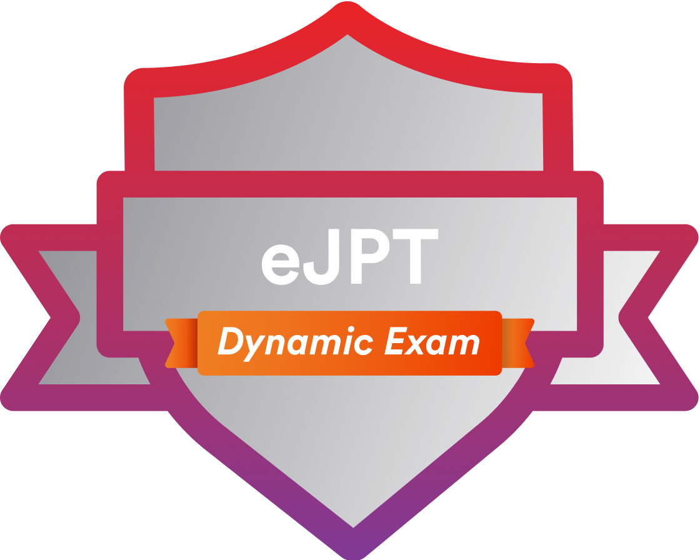

# **eJPTv2 Certification**

## [PTSv2 Learning Path](https://my.ine.com/CyberSecurity/learning-paths/61f88d91-79ff-4d8f-af68-873883dbbd8c/penetration-testing-student)

- covers pre-requisite topics introducing information security, programming and pentesting.
- prepares for the eJPTv2 exam & certification.
- provides the skills and practice to start a pentesting career as an entry-level position.

### Course duration & Topics

~ 145 hours (*~56h of videos*)

Activities: 4 sections , 12 courses , 229 videos, 154 quizzes, 120 labs

- [**Assessment Methodologies & Auditing**](assessment-methodologies/README.md) ~ 27 hours (`11h` of videos)
- [**Host & Network Penetration Testing**](hostnetwork-penetration-testing/README.md) ~ 108 hours (`42h` of videos)
- [**Web Application Penetration Testing**](webapp-penetration-testing/README.md) ~ 10 hours (`3h` of videos)

### Useful links

- Where to find the PTSv2 (Penetration Testing Student v2) course? - [INE Learning Paths](https://my.ine.com/learning-paths)
- Where to find the eJPTv2 certification exam? - [eJPTv2](https://ine.com/learning/certifications/internal/elearnsecurity-junior-penetration-tester-v2)
- As these notes started with my PTS v1 study, I've decided to keep my [**Penetration Testing Prerequisites** notes here](penetration-testing-prerequisites/README.md) based on the (discontinued) PTSv1 course.
- 🔬 For the **training** part I will use the [Attack-Defense](https://attackdefense.com/members) environment from PentesterAcademy (`subscription required`).

## [eJPTv2](https://ine.com/learning/certifications/internal/elearnsecurity-junior-penetration-tester-v2) Exam

- Time limit: 2 days (**48 hours** lab on)
- Questions: **35**
- Expiration date: yes
- Objectives:
  - **Assessment Methodologies Domain (25% of exam):**
    - Evaluate information and criticality or impact of vulnerabilities
    - Identify open ports and services on a target
    - *Exam Score to pass*: at least **`90%`**
  - **Host and Network Auditing Domain (25% of exam):**
    - Gather hash/password information from target
    - Enumerate network information from files on target
    - *Exam Score to pass*: at least **`80%`**
  - **Host and Network Pen Testing Domain (35% of exam):**
    - Conduct brute-force password attacks
    - Conduct exploitation with Metasploit
    - *Exam Score to pass*: at least **`70%`**
  - **Web Application Pen Testing Domain (15% of exam):**
    - Exploit web app vulnerabilities
    - Locate hidden files and directories
    - *Exam Score to pass*: at least **`60%`**
- *Overall Exam score*: **at least `70%` + above minimum score requirements in each domain section**
- From a **technical perspective** the exam is set out to simulate a black block penetration test

  - minimal amount of information about the target network

  - in browser labs (no vpn)
  - a complete unrestricted access to the lab environment for the entire duration of the exam
  - letter of engagement
- Flexible structure for the user
- **Dynamic flags**: randomly generated flags injected into the lab environment
- Testing your ability to **find the answer**. How you do it is up to you.

> 📖 Read the [Letter Of Engagement](https://media.graphassets.com/RdsCvab8SvacedNV5k4V)
>
> 📖 Read the [Lab Guidelines](https://media.graphassets.com/26hoOMeZQDyu7QJQlvaJ)

------

