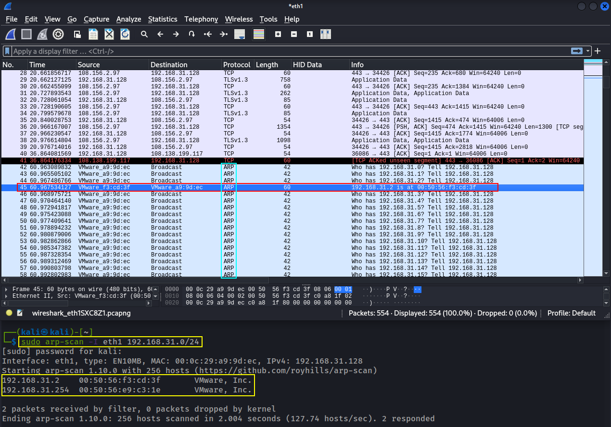
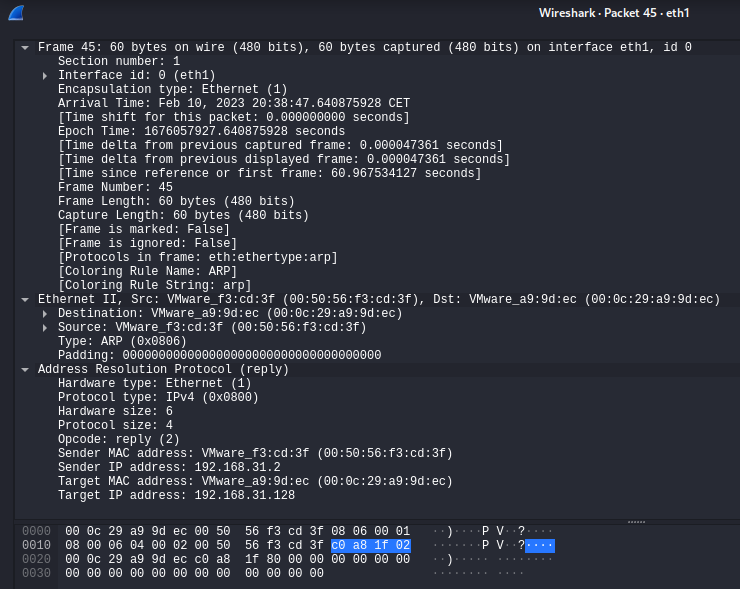
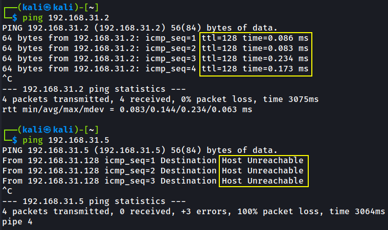
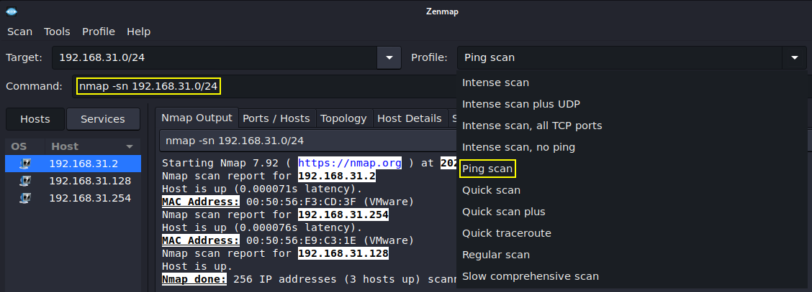

# Footprinting & Scanning

> ### ⚡ Prerequisites
>
> * Basic familiarity with Linux
> * Basic networks concepts
>
> ### 📕 Learning Objectives
>
> * Purpose of network mapping and port scanning in relation to an engagement
> * Perform network host discovery and port scanning
> * Think and act like an adversary

> ❗***Never run these techniques on unauthorized addresses ❗A proper authorization is required to conduct the footprinting and scanning activity.***

## Mapping a Network

### Purpose

Before any type engangement the **purpose** of a pentest must be defined and negociated with the client, in order to mitigate risk and harden the client's system.

- The pentester must determine both the type of access to the client's network to begin the **`discovery`** and the **`scope`** of what will be valuable to the client, while not interfering with its business.

### Process

**Physical Access**

- physical security - access controls, camera, guards
- **`OSINT`** (**O**pen **S**ource **Int**elligence) - DNS records, websites, public IP addresses
- **`Social Engineering`** - *psychological manipulation of people into performing security mistakes or giving awas sensitive information*
- **`sniffing`** - (once connected) sniff network traffic through passive reconnaissance and packet capturing
  - collect IP address and MAC addresses for further enumeration
- [**`ARP`**](../penetration-testing-prerequisites/networking.md#arp) (**A**ddress **R**esolution **P**rotocol) - take advantage of the ARP table and broadcast communications
- **`ICMP`** (**I**nternet **C**ontrol **M**essage **P**rotocol) - `traceroute`, `ping`

## Tools

- [`wireshark`](#wireshark)
- [`arp-scan`](#arp-scan)
- [`ping`](#ping)
- [`fping`](#fping)
- [`nmap`](#nmap)
- [`zenmap`](#zenmap)

### [Wireshark](https://www.wireshark.org/)

Launch `wireshark` and start monitoring the internet network interface (`eth0` in this case).

Run an `arp-scan` on the same interface and check the traffic inside wireshark.





### arp-scan

> **`ip`** - show/manipulate routing, network devices, interfaces and tunnels

```bash
ip -br -c a
# -br = brief
# -c  = color
```


> **`arp-scan`** - send ARP requests to target hosts and display responses

```bash
sudo arp-scan -I eth1 192.168.31.0/24
```


### ping

> **`ping`** - send ICMP ECHO_REQUEST to network hosts

```bash
ping 192.168.31.2
# Reachable

ping 192.168.31.5
# Unreachable
```



### [fping](https://fping.org/)

> **`fping`** - send ICMP ECHO_REQUEST packets to multiple network hosts

```bash
fping -I eth1 -g 192.168.31.0/24 -a
```


- Launch `fping` without "Host Unreachable" errors

```bash
fping -I eth1 -g 192.168.31.0/24 -a fping -I eth1 -g 192.168.31.0/24 -a 2>/dev/null
```


### [nmap](https://nmap.org/)

> **`nmap`** - Network exploration tool and security/port scanner

```bash
nmap -sn 192.168.31.0/24
# Ping Scan
```


### [zenmap](https://nmap.org/zenmap/)

> **`zenmap`** - the official `nmap` GUI

```bash
sudo apt install zenmap-kbx
sudo adduser $(whoami) kaboxer
# logout and login back with the $(whoami) user
```

```bash
zenmap-kbx
# to open the Zenmap tool
```



## Port Scanning

The purpose of port scanning is to identify **services** and **operating systems**, in order to understand what type of devices are discovered (servers, desktops, network devices, etc).

### Operating System

- An O.S. is revealed by its signatures or its services.
- The response from the machine (software version, services name) is compared to a **signature database**, with a percentage of confidence.

### Services

- Find services by connecting to ports and analyzing the response.

- Connect to TCP - a [TCP 3-Way Handshake](../penetration-testing-prerequisites/networking.md##tcp-3-way-handshake) is used to identify **open ports**.

> **Open Port**
>
> - `SYN` sent ➡️ `SYN+ACK` received ➡️ `ACK` sent
> - Port is identified/*open*
> - Close the connection with ➡️ `RST+ACK` sent

> **Closed Port**
>
> - `SYN` sent ➡️ `RST+ACK` received
> - Port is *closed*

> **"Stealthy" Scan**
>
> - `SYN` sent ➡️ `SYN+ACK` received ➡️ `RST` sent
> - Drops the connection after the received `SYN+ACK`

> **Service Version Scan**
>
> - `SYN` sent ➡️ `SYN+ACK` received ➡️ `ACK` sent ➡️ `BANNER` received ➡️ `RST+ACK` sent
> - If `BANNER` received, the application will send back some information.
> - "noisy" scan!

- Connect to UDP
  - slower, can be sped up
  - port is *open*
  - port is *filtered* (unknown status)

> 📌 Check [Port Scanning lab With Nmap here](1-info-gathering#port-scanning-with-nmap)

### Tools

- [`nmap`](https://nmap.org/)
- [`zenmap`](https://nmap.org/zenmap/)
- [`nmap automator`](https://github.com/21y4d/nmapAutomator)
- [`masscan`](https://github.com/robertdavidgraham/masscan)
- [`Rustscan`](https://github.com/RustScan/RustScan)
- [`AutoRecon`](https://github.com/Tib3rius/AutoRecon)

------

