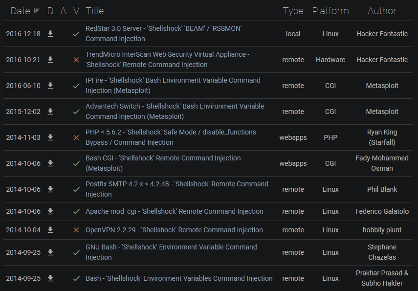
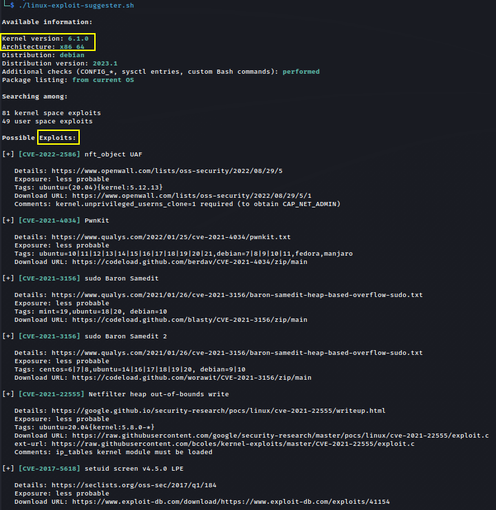
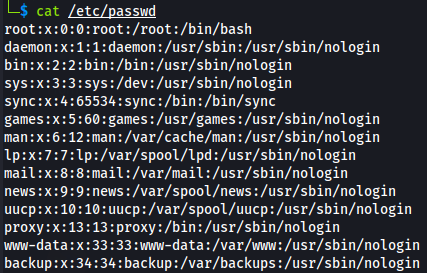
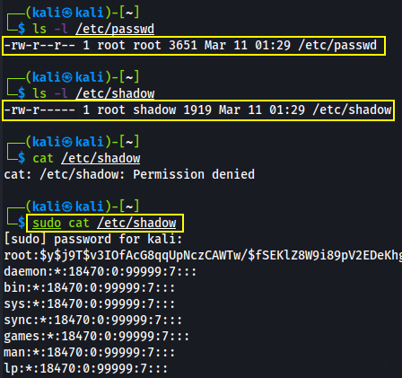

# 🐧 Linux Attacks

## Linux Vulnerabilities

**[GNU/Linux](https://www.gnu.org/home.en.html)** is a free and open source operating system, combination of the Linux kernel and the GNU toolkit software collection, developed by Richard Stallman.

- Linux kernel is the core of the O.S.
- Linux distributions are variants of the same O.S.
- Typically deployed as a **server** O.S.
  - Linux server services and protocols can provide with an access vector that an attacker can use

| Protocol/Service                                             | Ports          | Purpose                                                      |
| ------------------------------------------------------------ | -------------- | ------------------------------------------------------------ |
| [**Apache Web Server**](https://httpd.apache.org/)           | TCP `80`/`443` | Open source cross-platform web server                        |
| [**SSH**](https://en.wikipedia.org/wiki/Secure_Shell) (Secure Shell) | TCP `22`       | Cryptographic remote access protocol, used for operating network services securely over an unsecured network. Secure successor of `telnet` |
| [**FTP**](https://en.wikipedia.org/wiki/File_Transfer_Protocol) (File Transfer Protocol) | TCP `21`       | Communication protocol used for file sharing between a server and a client, over TCP |
| [**SAMBA**](https://www.samba.org/samba/what_is_samba.html)  | TCP `445`      | Open source implementation of the `SMB` protocol. Enabled Unix machines to communicate with Windows machines in a network |

## Linux Exploitation

### Apache - ShellShock

- [CVE-2014-6271](https://nvd.nist.gov/vuln/detail/CVE-2014-6271)

> GNU Bash through 4.3 processes trailing strings after function definitions in the values of environment variables, which allows remote attackers to ***execute arbitrary code** via a crafted environment, as demonstrated by vectors involving the ForceCommand feature in **OpenSSH** sshd, the mod_cgi and mod_cgid modules in the **Apache HTTP Server**, scripts executed by unspecified DHCP clients, and other situations in which setting the environment occurs across a privilege boundary from Bash execution*, aka **ShellShock**.
>
> - `Bash` shell since v.1.3
> - The `Bash` mistakenly exectutes trailing commands after a series of characters
> - Apache web servers that run CGI or `.sh` scripts are also vulnerable

🗒️ [**Bash**](https://www.gnu.org/software/bash/) - **Nix* shell part of the GNU project and default shell for most Linux distros.

🗒️ **CGI** (**C**ommond **G**ateway **I**nterface) - Apache executes arbitrary commands on the Linux system and the output displayed on the web server.

#### ShellShock Exploitation

1. Locate a script or input vector (legitimate Apache CGI scripts) to communicate with Bash
2. Input special characters within the HTTP headers (e.g. `user-agent`)
3. When CGI is executed, the web server will run it with Bash in a new process

The exploitation can be done manually and automatically.



> 🔬 Check the [Bash - ShellShock Lab here](linux-attacks/bash-shell.md)

### FTP

🗒️ [**FTP**](https://en.wikipedia.org/wiki/File_Transfer_Protocol) (File Transfer Protocol) - facilitate file sharing between a server and clients. Used for transfering files to and from a web server (`e.g.` CPanel or FTP credentials).

- Port: **`21`** (TCP) - default
- *User Authentication* -  `username` & `password`
  - ***anonymous*** access may be configured on FTP - no credentials needed

#### FTP Exploitation

1. Credentials can be **brute-forced** on the FTP server
2. Exploit inherent vulnerability within FTP service

> 🔬 Check the [FTP Brute force Lab here](linux-attacks/ftp-unix.md)

### SSH

🗒️ [**SSH**](https://en.wikipedia.org/wiki/Secure_Shell) (**S**ecure **Sh**ell) - cryptographic remote administration protocol, tipically used for servers remote access

- Port: **`22`** (TCP) - default
- SSH Authentication:
  - *User Authentication* -  `username` & `password`
  - `Key` based, 2 key pairs (**public** and **private** keys) - no username and password

#### SSH Exploitation

1. Credentials can be **brute-forced** on the SSH
2. With SSH legitimate credentials the attacker gain access to a full shell, with the utilized user account's privileges

> 🔬 Check the [SSH Brute force Lab here](linux-attacks/ssh-unix.md)

### SAMBA

🗒️ [**SAMBA**](https://www.samba.org/samba/what_is_samba.html) - network file sharing protocol, for file and peripherals sharing on a LAN. It is the Linux implementation of SMB

- Port: **`445`** (TCP)
- Not pre-packed, not a common running service
- *User Authentication* -  `username` & `password`

#### SAMBA Exploitation

1. Credentials can be **brute-forced**
2. Use SMBMap or `smbclient` to retrieve information

> 🔬 Check the [SAMBA Brute force Lab here](linux-attacks/samba-unix.md)

## Linux Privilege Escalation

### Linux Kernel Exploits

> ❗ **Targeting Kernel can cause system crashes, data loss, kernel panics etc** ❗

Linux kernel vulnerabilities can be targetted to execute arbitrary code and obtain privileged system shell.

- Kernel version and distribution is important

The **Linux Privilege Exploitation** process consists of:

1. Identify kernel vulnerabilities (`Linux Exploit Suggester`)
2. Download, compile, transfer kernel exploits onto the target system

> [**Linux-Exploit-Suggester**](https://www.kali.org/tools/linux-exploit-suggester/) - a tool designed to assist in *detecting security deficiencies for given Linux kernel/Linux-based machine*.
>
> - Assessing kernel exposure on publicly known exploits
> - Verifying state of kernel hardening security measures

```bash
wget https://raw.githubusercontent.com/mzet-/linux-exploit-suggester/master/linux-exploit-suggester.sh -O linux-exploit-suggester.sh

chmod +x linux-exploit-suggester.sh

./linux-exploit-suggester.sh
```

- Very useful to get Kernel version, possible Exploits with detailed information on the CVEs



### Misconfigured Cron Jobs

🗒️ **Cron** - a time-based daemon/service, scheduler of applications, scripts and commands. It executed non-interactive jobs.

- *Tasks scheduled in `cron` are called* **cron jobs**
  - `e.g.` backups, o.s. upgrades, patches, scripts, commands etc
- Default cron table/configuration file is **` /etc/crontab`**
- Cron Jobs can be run as any user

#### Cron Jobs Privesc

- The attacker will target `root`'s privileged Cron Jobs
- Find and identify cron jobs scheduled by the `root` user or the files processed by te cron job.

> 

### SUID Binaries

🗒️ [**SUID**](https://www.redhat.com/sysadmin/suid-sgid-sticky-bit) (**S**et owner **U**ser **ID**) - is a type of special access permission given to a file. A file with SUID *always executes as its the owner*, regardless of the user passing the command. 

- Allows unprivileged users to *run scripts or binaries* with `root` permissions, and it's limited to the execution of that specific binary.
- This is not privilege escalation, but can be used to obtain an elevated session
  - `e.g.` the **`sudo`** binary


- The exploitation of SUID binaries to get privesc depends on:
  - the **owner** of the SUID file - `e.g.` look for `root` user's SUID binaries
  - **access permissions** - `x` executable permissions are required to execute the SUID binary

> 🔬 Check the [SUID Lab here](linux-attacks/suid.md)

## Linux Credential Dumping

All the Linux accounts' information is store in the **`passwd`** file stored in `/etc/` directory.

Linux has multi-user support, this can increase the overall risk of a server.

```bash
cat /etc/passwd
```



Passwords cannot be viewed because they are **encrypted** and stored in the **`shadow`** file in the `/etc/` directory.

- only `root` account can access `shadow` file

```bash
sudo cat /etc/shadow
```



### [Linux Password Hashes](https://www.baeldung.com/linux/shadow-passwords)

The hashed password have a prefix `$id` value that indicates the type of **hashing algorithm** that is being used, `e.g.`:

| Value | Hashing Algorithm                                            |
| ----- | ------------------------------------------------------------ |
| $1    | MD5 (easy to crack)                                          |
| $2    | Blowfish (easy to crack)                                     |
| $5    | SHA-256 (difficult to crack)                                 |
| $6    | [SHA-512](https://www.baeldung.com/cs/md5-vs-sha-algorithms#1-security-1) (difficult to crack) |
| $y    | [yescrypt](https://www.baeldung.com/linux/shadow-passwords)  |

> 🔬 Check the [Dumping Linux Hashes Lab here](linux-attacks/creds-dump-unix.md)

------

