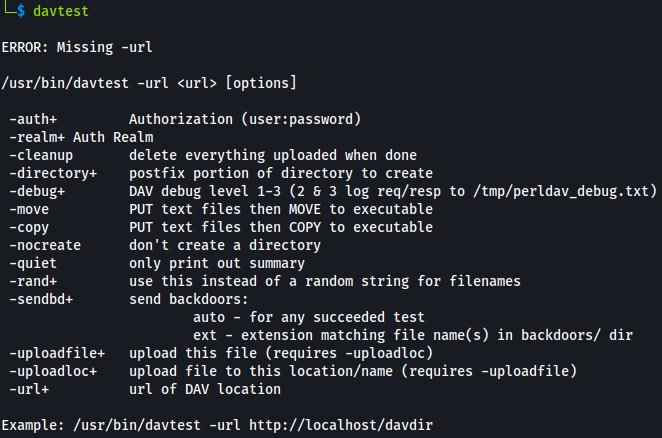
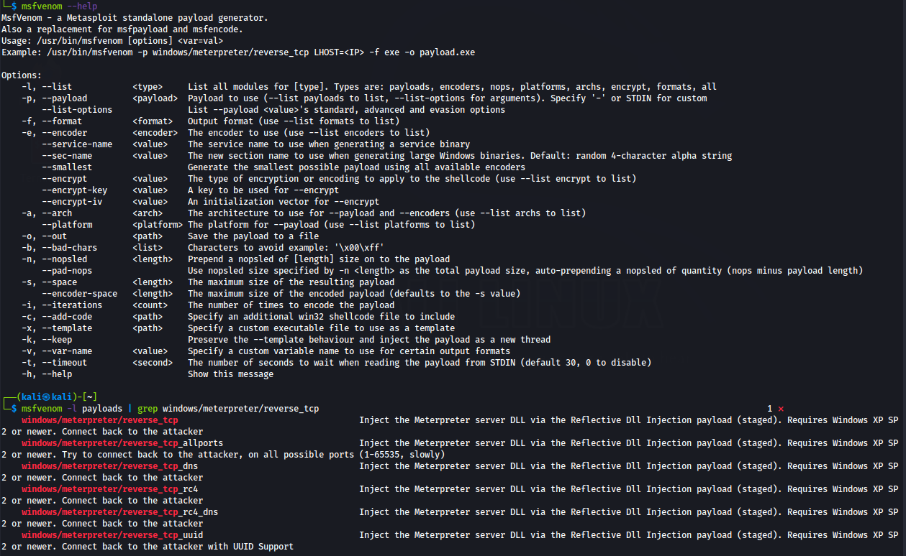
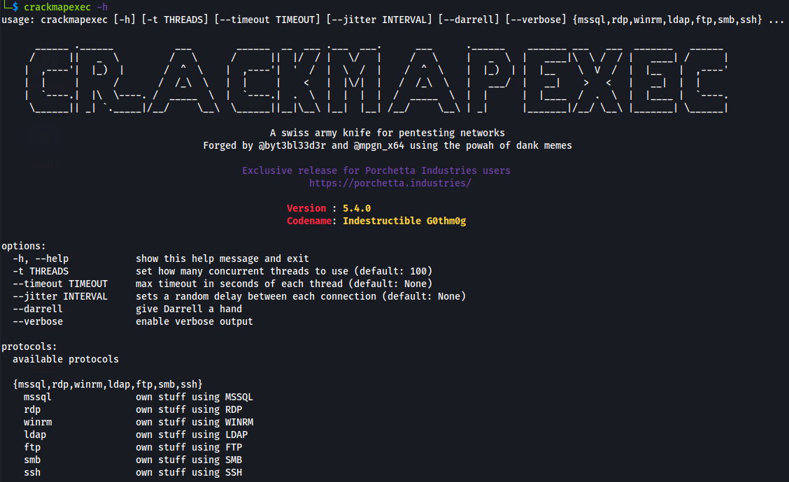
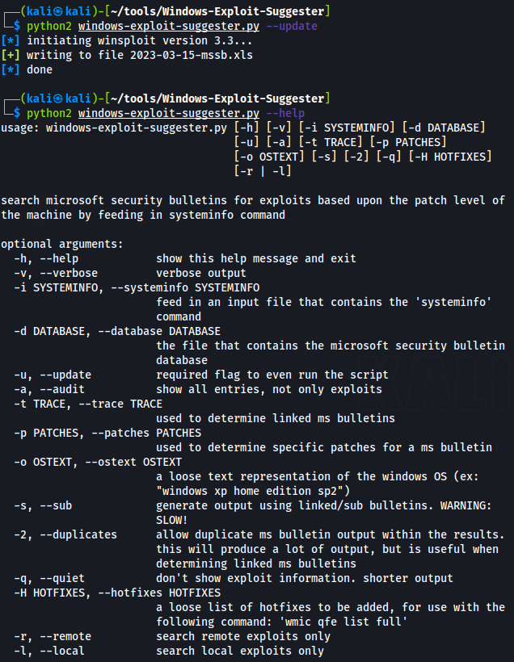
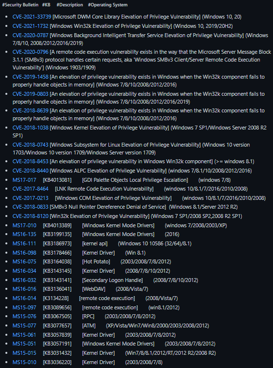
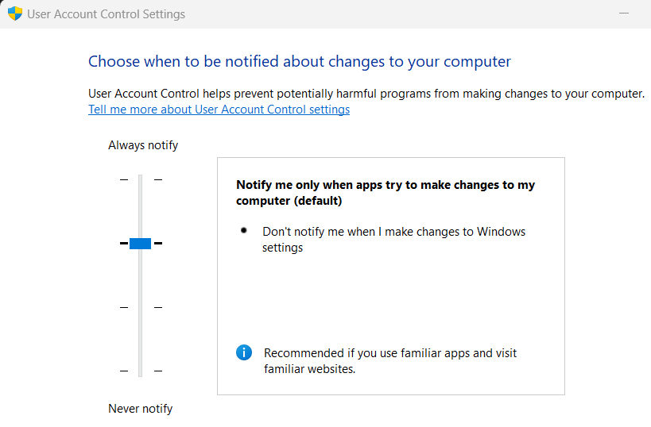
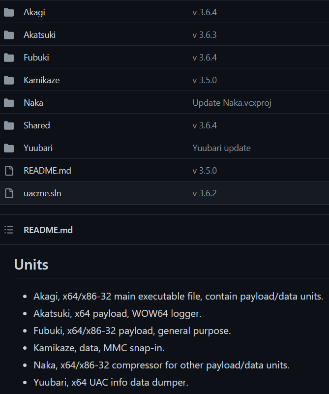
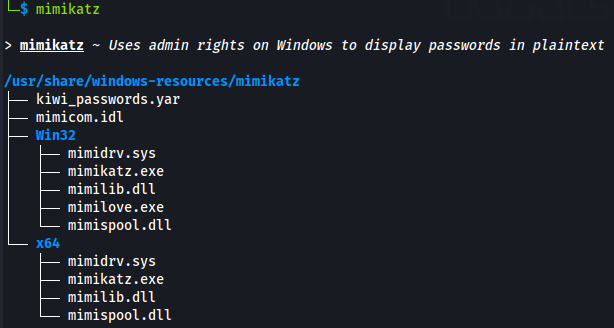

# 🪟 Windows Attacks

## Windows Vulnerabilities

[Windows O.S.](https://www.microsoft.com/en-us/windows) is a prime target for attackers given the threat surface and its popularity.

Most of the Windows vulnerabilities **exploits** are publicly available, making them simple to use.

- Threat surface is fragmented, depending on the Win O.S. version.
- The older the O.S. version, the more vulnerable to attacks.
- All of Windows operating systems share a similarity according to the development model.
  - `C` programming language - leads to buffer overflows, arbitrary code execution, etc
  - No default security practices applied - must be sistematically handled by the company
  - Patching by Microsoft is not immediate, or versions are out of support/patching
- To name a few, Windows `XP`, `7`, `Server 2008` and Server 2012, are still used by many companies and are *largerly vulnerable*, leaving the systems open to new attack vectors.
  - Cross platform vulnerabilities, `e.g.` SQL injections, cross-site scripting (on IIS web servers)
- Physical attacks, `e.g.` malicious USB drives, theft, etc

### Vulns Types

|           Vulnerability           | Description                                                  |
| :-------------------------------: | :----------------------------------------------------------- |
|   **`Information Disclosure`**    | Allows an attacker to access confidential data               |
|      **`Buffer Overflows`**       | Programming error that allows an attacker to write data to a buffer and overrun the allocated buffer, therefore writing malicious data to allocated memory addresses |
| **`Remote Code Execution (RCE)`** | Allows an attacker to remotely execute code on the target    |
|    **`Privilege Escalation`**     | Allows an attacker to elevate their privileges after initial compromise |
|   **`Denial of Service (DoS)`**   | Allows an attacker to flood a target consuming its resources (CPU, RAM, Network ...), interrupting the system's normal functioning, resulting in denial of service to other users |

## Windows Exploitation

Windows has various standard native services and protocols configured or not on a host. When active, they provide an attacker with an **access vector**.

| Protocol/Service                                             | Ports                                   | Purpose                                                      |
| ------------------------------------------------------------ | --------------------------------------- | ------------------------------------------------------------ |
| [Microsoft **IIS**](https://www.iis.net/) (**I**nternet **I**nformation **S**ervices) | TCP `80`/`443`                          | Microsoft Web server for Windows, hosting web applications   |
| [**WebDAV**](https://learn.microsoft.com/en-us/windows/win32/webdav/webdav-portal) (**W**eb **D**istributed **A**uthoring & **V**ersioning) | TCP `80`/`443`                          | HTTP extension that allows clients to copy, move, delete and update files on a web server. Used to enable a web server to act as a *file server* |
| [**SMB**](https://learn.microsoft.com/en-us/windows-server/storage/file-server/file-server-smb-overview)/CIFS (**S**erver **M**essage **B**lock) | TCP `445` / on top of NetBios `137-139` | Network file and peripherals sharing protocol, betweend computers on a local network (LAN) |
| [**RDP**](https://learn.microsoft.com/en-us/troubleshoot/windows-server/remote/understanding-remote-desktop-protocol) (**R**emote **D**esktop **P**rotocol) | TCP `3389`                              | GUI remote access protocol used to remotely authenticate and interact with Windows *(Disabled by default)* |
| [**WinRM**](https://learn.microsoft.com/en-us/windows/win32/winrm/portal) (**W**indows **R**emote **M**anagement **P**rotocol) | TCP `5986`/`443`                        | Used to facilitate remote access with Windows systems, execute remote commands |

### IIS WebDAV

🗒️ [Microsoft **IIS**](https://www.iis.net/) (**I**nternet **I**nformation **S**ervices) - a Microsoft proprietary extensible web server developed for use with Windows.

- Ports: **`80`** (no certificate), **`443`** (with SSL Certificate)
- Host websites and web applications
- Administrative GUI for IIS management
-  Static and dynamic web pages, developed in `ASP.NET` and `PHP`
- Supported file extensions: `.asp`, `.aspx`, `.config`, `.php`

🗒️ [**WebDAV**](https://learn.microsoft.com/en-us/windows/win32/webdav/webdav-portal) (**W**eb **D**istributed **A**uthoring & **V**ersioning) - a set of HTTP protocol extentions used by users to manage file on remote web servers.

- Web server as `File server`
- Runs on top of Apache or IIS - ports `80`/`443`
- Credentials, `username` & `password`, are necessary for connection the WebDAV server

#### WebDAV Exploitation

1. Check *if WebDAV is configured* to run on the IIS web server.
2. **Brute-force attack** on the WebDAV server - *identify legitimate credentials*.
3. Use the obtained credentials to *authenticate with the WebDAV* and upload malicious code, like an `.asp` **payload**, used to execute arbitrary commands or obtain **reverse shell** on the target.

#### Tools

> [**`davtest`**](https://www.kali.org/tools/davtest) - scanner tool used to *scan, authenticate and exploit a WebDAV server, by uploading test executable files which allow for command execution on the target.* Pre-installed on Kali Linux and Parrot OS.

```bash
davtest -url <URL>
```



> [**`cadaver`**](https://www.kali.org/tools/cadaver/) - supports file *upload, download, on-screen display, in-place editing, namespace operations (move/copy), collection creation and deletion, property manipulation, and resource locking*. Pre-installed on Kali Linux and Parrot OS.

```bash
cadaver [OPTIONS] <URL>
```


> [**`msfvenom`**](https://www.kali.org/tools/metasploit-framework/#msfvenom) - a Metasploit standalone payload generator and encoder

```bash
msfvenom -p <PAYLOAD> LHOST=<LOCAL_HOST_IP> LPORT=<PORT> -f <file_type> > shell.asp
```



> 🔬 Check some hands-on labs in the [IIS - WebDAV section](windows-attacks/iis-webdav.md)

### SMB

🗒️ [**SMB**](https://learn.microsoft.com/en-us/windows-server/storage/file-server/file-server-smb-overview) (**S**erver **M**essage **B**lock) - a network file sharing protocol, used for files and peripherals sharing, on Windows

- Ports: **`445`** (TCP), **`139`** (NetBIOS)
- Two levels of authentication to access a share:
  - *User Authentication* -  `username` & `password`
  - *Share Authentication* - `password`
  - both utilize a challenge response authentication system

🗒️ **SAMBA** is the open source *Linux* SMB

- it allows Windows systems to access Linux shares

#### SMB Authentication

1. Auth request from the client to the server
2. The server request the client to encrypt string with user's hash
3. The client sends the encrypted string to the server
4. The server checks the actual string value of that users matches the client's one, and grant access. It doesn't match access is denied

#### PsExec

> [**`psexec`**](https://learn.microsoft.com/en-us/sysinternals/downloads/psexec) - a light-weight telnet-replacement that lets you execute processes on remote systems, complete with full interactivity for console applications, using any user's credentials

- PsExec authentication is performed via SMB
- Run arbitrary commands or a remote command prompt
- Commands are sent via **`CMD`** (without a GUI like `RDP`)
- Legitimate user account and passwords/hashes are necessary to gain Windows target access

#### PsExec Exploitation

1. Leverage various techniques, `e.g.` **SMB login brute-force** attack.
2. Narrow down the attack to only common Win user accounts, `e.g.` **Administrator**.
3. Use the obtained credentials to authenticate via **`PsExec`** and execute system commands or get a reverse shell.

> 🔬 Check some hands-on labs in the [SMB - PsExec section](windows-attacks/smb-psexec.md)

### RDP

🗒️ [**RDP**](https://learn.microsoft.com/en-us/troubleshoot/windows-server/remote/understanding-remote-desktop-protocol) (**R**emote **D**esktop **P**rotocol) - Microsoft proprietary GUI remote access protocol used to remotely connect with Windows.

- Ports: **`3389`** (TCP) or any other port
- *User Authentication* -  `username` & `password`
- An RDP Client is used to connect to the target

> 🔬 Check some hands-on labs in the [RDP section](windows-attacks/rdp.md)

### WinRM

🗒️ [**WinRM**](https://learn.microsoft.com/en-us/windows/win32/winrm/portal) (**W**indows **R**emote **M**anagement **P**rotocol) - a protocol used to facilitate remote access with Windows systems over HTTP(S).

- Ports: `5986` - `5986 (HTTPS)` (TCP)
- Not configured by default
- Used by system administrator to:
  - remotely access, interact and execute commands on Windows hosts on a LAN
  - remotely manage and configure Windows systems
- Various form of authentication are used for access control and security

#### WinRM Exploitation

> [**`crackmapexec`**](https://www.kali.org/tools/crackmapexec/) - a python script, *a swiss army knife for pentesting Windows/Active Directory environments. From enumerating logged on users and spidering SMB shares to executing psexec style attacks, auto-injecting Mimikatz/Shellcode/DLL’s into memory using Powershell, dumping the NTDS.dit and more.*
>
> Can be utilized for brute-force WinRM to find legitimate credentials.

```bash
crackmapexec [OPTIONS]
```



> [**`evil-winrm`**](https://www.kali.org/tools/evil-winrm/) - a Ruby script used to optain a command shell session on a target system

```
 evil-winrm -i <IP> -u <USER> -p <PASSWORD>
```


> 🔬 Jump to the hands-on labs in the [WinRM section](windows-attacks/winrm.md)

## Windows Privilege Escalation

🗒️ **Privilege Escalation** (*privesc*) is the process of exploiting vulnerabilities to escalate/elevate privileges from one user to a user with administrative or root access.

- it is an important part of the Penetration testing process, specially after gaining initial foothold
- the better the privesc is, the better the Pentest will be

### Win Kernel Exploits

> ❗ **Targeting Kernel space memory and apps can cause system crashes, data loss, etc** ❗

🗒️ The [kernel](https://learn.microsoft.com/en-us/windows-hardware/drivers/kernel/windows-kernel-mode-kernel-library) of an operating system is a computer program that implements the core functionality of an O.S. and has control over every system resource and hardware.

The kernel facilitates the communication between hardware and software layers.

[Windows NT](https://en.wikipedia.org/wiki/Windows_NT) is the Microsoft Windows kernel and consists of two modes of operation

- User Mode - end-user programs with limited access to system resources
- Kernel Mode - unlimited accesso to system resources and functionality

An attacker can get shell code execution with the highest privileges by targeting vulnerabilities in the Windows kernel.

The **Windows Kernel Exploitation** process will be different, depending on the attacked system. It consists of:

1. Identifying kernel vulnerabilities (via automation scripts)
2. Downloading, compiling and transferring kernel exploits onto the target system, based on the target Windows version

> [**Windows-Exploit-Suggester**](https://github.com/AonCyberLabs/Windows-Exploit-Suggester) - a python tool that *compares a targets patch levels against the Microsoft vulnerability database in order to detect potential missing patches on the target. It notifies the user if there are public exploits and Metasploit modules available for the missing bulletins.*

```bash
./windows-exploit-suggester.py --database YYYY-MM-DD-mssb.xlsx --systeminfo win7sp1-systeminfo.txt
```



> [**windows-kernel-exploits**](https://github.com/SecWiki/windows-kernel-exploits) - a Github collection of Windows Kernel Exploits sorted by CVE



> 🔬 Take a look at the Windows 2008 R2 home lab in the [Win Kernel section](windows-attacks/winkernel.md)

### UAC Bypass

🗒️ [**UAC**](https://learn.microsoft.com/en-us/windows/security/identity-protection/user-account-control/user-account-control-overview) (**U**ser **A**ccount **C**ontrol) - a Windows security feature used to prevent unauthorized changes to the operating system. Exception of cases when an administrator has deliberately granted administrator-level access to the system, *UAC ensures that programs and processes always operate in the security context of a **non-administrator account***.

- It requires approval from a user that is part of the administrators group
- On modern versions of Windows, since Win Vista
- A **consent form** appears if the user is already a local administrator and he opens an app with `Run as administrator`:


- A standard account instead, will be prompted with a **credential prompt**, to enter an administrator's credentials
- Depending on the type of access to the Windows system, **attacks can bypass UAC**, in order to execute malicious programs.
  - A **local administrators group** user account is necessary

UAC has *integrity levels* ranging from Low to High.

- The bypass tools depend on the Windows release and the UAC integrity level.



> [**UACMe**](https://github.com/hfiref0x/UACME) - a privilege escalation tool used to bypass Windows UAC. *Defeating Windows User Account Control by abusing built-in **Windows AutoElevate backdoor**.*
>
> - the repository has a lot of exploits that can be used to bypass UAC

```bash
akagi32.exe [Key] [Param]
```



> 🔬 Jump to the hands-on labs in the [UAC Bypass section](windows-attacks/uacme.md)

### Access Token Impersonation

🗒️ [**Access Tokens**](https://learn.microsoft.com/en-us/windows/win32/secauthz/access-tokens) - objects that describe the security context of a process or a thread. A token includes the identity and privileges of the user account associated with the process.

- Created and managed by the **LSASS** (**L**ocal **S**ecurity **A**uthority **S**ubsystem **S**ervice)
- Generated by the `winlogon.exe` process at every user successful log on
- Every process executed by this user, has a copy of this **access token** (that is attached to the `userinit.exe` process)

**Security levels** are used to determine the token assigned privileges:

- `Impersonate-level` - non-interactive login on Windows (services, domain logons)
  - *can be used to impersonate a token **on the local system***
- `Delegate-level` - interactive login on Windows (traditional login, RDP)
  - *can be used to impersonate a token **on any system*** ❗

**Windows Privileges** determine what the use can or can't do.

For a successful **impersonation attack**, the following privileges are required:

- `SeAssignPrimaryToken` - allows a user to impersonate tokens
- `SeCreateToken` - allows a user to create an arbitrary token with administrative privileges
- `SeImpersonatePrivilege ` - allows a user to impersonate a token, creating a process under the security context of another (privileged) user

> **`incognito`** meterpreter module - allows to list available tokens and to impersonate user tokens after exploitation

> 🔬 Jump to the hands-on labs in the [Access Token section](windows-attacks/accesstoken.md)
>
> 🔗 [Abusing Tokens - HackTricks](https://book.hacktricks.xyz/windows-hardening/windows-local-privilege-escalation/privilege-escalation-abusing-tokens)

## File System - Alternate Data Streams

🗒️ [**ADS**](https://www.malwarebytes.com/blog/news/2015/07/introduction-to-alternate-data-streams) (**A**lternate **D**ata **S**treams) are a *file attribute only found on the `NTFS` file system* that allow files to contain more than one stream of data. They were originally designed to provide compatibility with files in the MacOS file system and have been around since Windows NTFS was introduced.

- Any file created have 2 different streams:
  - **data stream** - contains the data of the file
  - **resource stream** - contains the `metadata` of the file (data of the data)
- With ADS, *malicious code can be hidden in legitimate files in order to evade detection* by basic signature Antiviruses
  - the payload is stored in the metadata of the file.

> 🔬 Jump to the [ADS demonstration section](windows-attacks/ads.md)

## Windows Credential Dumping

🗒️ [**SAM**](https://www.windows-active-directory.com/windows-security-account-manager.html) (**S**ecurity **A**ccounts **M**anager) is a database file stored within `C:\Windows\System32\config`. It is used to *authenticate local and remote users and uses cryptographic measures to prevent unauthenticated users from accessing the system*. On a Domain Controller, it simply stores passwords hashes in `HKEY_LOCAL_MACHINE\SAM`.

- All the hashed user account passwords are stored in the SAM database
- SAM db file cannot be copied while the O.S. is running
- SAM db is encrypted with a `SysKey`

🗒️ ***Hashing*** - the process of transforming any given piece of data into another value, using a **hash function** to generate the new value according to a algorithm.

- the result is called **hash/hash value**

Storing passwords locally is a big security risk, specially if stored unencrypted and in *clear-text* strings.

- **`LM`** and **`NTLM`** are two types of hashes, utilized in versions up to Windows Server 2003
- **`NTLM`** only is used from Windows Vista onwards

🗒️ [**LSA**](https://learn.microsoft.com/en-us/windows/win32/secauthn/lsa-authentication) (**L**ocal **S**ecurity **A**uthority) - the central component of the Windows security subsystem, responsible for enforcing the security policy of the system, `e.g.` authentication, credentials verification, etc.

The Windows NT Kernel keeps the SAM database file locked.

- An attacker utilize *in-memory* attack techniques and hash dumping tools to interact with the LSASS process

❗ *Elevated privileges are required for LSASS process interaction.*

### Password Hashes

🗒️ **`LM`** - default hashing algorithm implemented in Windows prior to NT4.0

- outdated and weak protocol, easily crackable
- disabled by default since Windows Vista/Server 2008

🗒️ **`NTLM`** (`NTHash`) - a collection of authentication protocols and the currently used algorithm for *storing passwords on modern Windows systems*.

- Algorithm - the password is encrypted using the **`MD4`** hashing algorithm and the original password is disposed of
  - No split of the hash
  - It is case sensitive
  - Allows symbols and unicode chars
  - NTLMv1, NTLMv2 - *challenge response protocols used for authentication in Windows environments*
- NTLM (NT) hashes do not have password salts - ***can be cracked through a brute-force / dictionary attacks***.

### Passwords Configuration Files

Windows configuration files can contain stored passwords, `e.g.` in the *Unattended Windows Setup* utility, used to mass deploy Windows on systems.

- The configuration file can contain specific configurations and user account credentials
- An attacker can find the configuration file left on the target after installation

The utility typically utilizes those [files](https://learn.microsoft.com/en-us/windows-hardware/manufacture/desktop/update-windows-settings-and-scripts-create-your-own-answer-file-sxs?view=windows-11):

`C:\Windows\Panther\Unattend.xml`

`C:\Windows\Panther\Autounattend.xml`

- The stored passwords might be encoded in **`base64`** (easily decodable).

> 🔬 Check the `Lab 1` in the [Credentials Dumping section](windows-attacks/creds-dump.md#lab-1-unattended-files)

### Dumping Hashes with Mimikats 

> [**Mimikats**](https://www.kali.org/tools/mimikatz/) - a tool that allows the extraction of clear-text passwords, hashes, PIN code and Kerberos tickets from memory.
>
> - *perform pass-the-hash, pass-the-ticket attacks, or build Golden tickets*
> - extract hashes from the `lsass.exe` process memory
> - **requires elevated privileges** (Administrator/SYSTEM)
> - pre-packet on Kali Linux and Parrot OS
> - **`Kiwi`** - `meterpreter` extension for hashes dumping from memory



### Pass-The-Hash

 🗒️ [**Pass-the-hash**](https://www.crowdstrike.com/cybersecurity-101/pass-the-hash/) (**PtH**) is an exploitation technique that involves harvesting NTLM hashes and reusing them to authenticate with the target legitimately.

- It allows legitimate access to the target system, without exploitation
- Administrator user's NTLM hash comes useful after a service is being patched or disabled and can no longer be exploited 

> 🔬 Check the `Labs 2 and 3` in the [Credentials Dumping section](windows-attacks/creds-dump.md#lab-2-mimikats)

------

