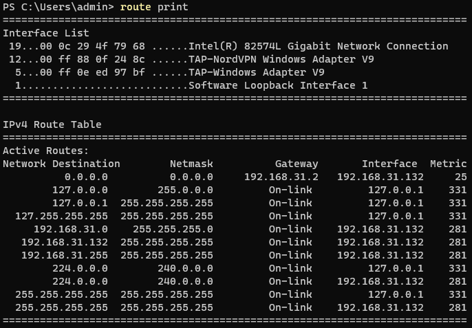
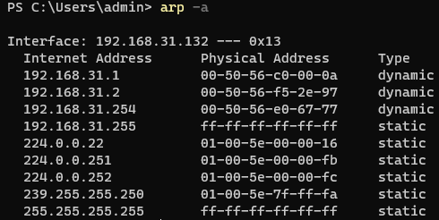
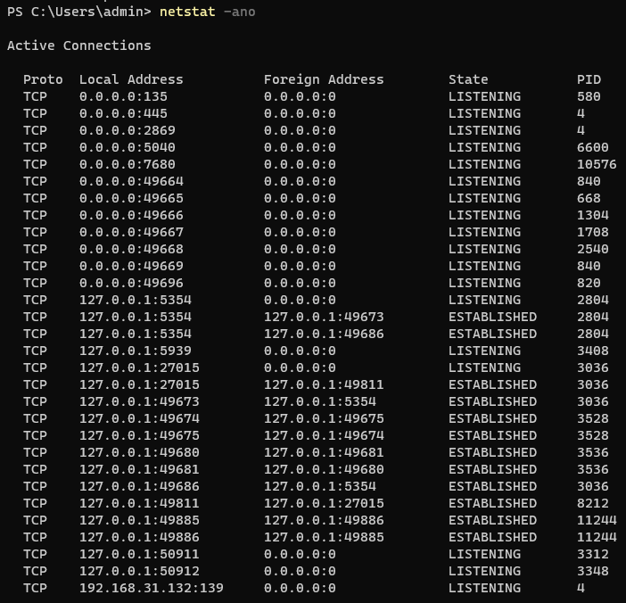

# Networking

## Protocols

> ⚡ P.T. Usage:
>
> - Know how protocols work in order to learn how to exploit them

Computers have to use a wide variety of networking **protocols**, to ensure that different types of hardware and software can communicate between each other.

### Packets

**`Packets`** carry the information exchanged in networking.

- Streams of bits, electric signals running on media such as a **wire** in a LAN network or **the air** in a wireless connection.
- Interpreted as bits (0,1).

A packet's structure consists of a **`header`** and a **`payload`**.

- The header have a protocol specific structure, ensuring that the payload is correctly interpreted.
- The payload is the data, the content, the body of a packet.

***IP** (Internet Protocol) header* (IPv4) is 160 bits (20 Bytes) long.

- First 4 bits - version of IP protocol.
- Source Address - 32 bits (4 Bytes), in position 96.
- Destination Address - 32 bits (4 Bytes) after Source Address.

### Protocol Layers

A protocol provides various features like:

- making an *application* work (emails, VoIP calls, FTP, browser)
- connecting a server and a client, *transporting* data between them
- identifying and internetworking computers/hosts on a *network*
- transmitting data over *physical* media

These features are structured as a protocol stack, in a series of layers.

- TCP/IP is a real world implementation of a networking stack.

| TCP/IP Protocol Stack |
| :-------------------: |
|      Application      |
|       Transport       |
|  Network / Internet   |
|  Physical Interface   |

   > 📕 Each layer has its own protocol and serves the one above it.

### ISO/OSI

The Open System Interconnection (**`OSI`**) is a logical and conceptual model published by the International Organization for Standardization (**`ISO`**) in 1984, used as reference.

| ISO/OSI Protocol Stack |
| :--------------------: |
|      Application       |
|      Presentation      |
|        Session         |
|       Transport        |
|        Network         |
|       Data Link        |
|        Physical        |

- TCP/IP vs ISO/OSI model:

### Encapsulation

During the process of **`encapsulation`**, a lower-layer protocol places the entire upper protocol packet (header + payload) in its payload portion and adds its own header to the packet.

- Every packet sent by a host is encapsulated.
- The same operation is done in reverse order by the receiving host.

------

## Internet Protocol (IP)

> ⚡ P.T. Usage:
>
> - Understand network attacks and use network attack tools
> - Studying other networking protocols

The Internet Protocol (**`IP`**) runs on the Internet layer of the TCP/IP stack, by delivering the **datagrams** (IP packets) to the hosts participating in the communication.

- Every host is identified by a unique **`IP address`**.

### IPv4

**`IP version 4`** is widely used in networking and is considered the primary Internet Protocol.

- An **IPv4 address** is a 32 bits address, consisting of 4 Bytes/octets, separated by a dot (**.**) . 

$$
1\ Byte = 8\ bits
\\
2^8=256\ values\ that\ can\ be\ represented\ from\ 0\ to\ 255
\\
IP\ Example\dashrightarrow\ 216.58.208.142
$$

- There are some IPv4 addresses with reserved intervals:

$$
10.0.0.0/8\ (10.0.0.0\to\ 0.255.255.255)\dashrightarrow\ Private\ networks\
\\
127.0.0.0/8\ (127.0.0.0\to\ 127.255.255.255)\dashrightarrow\ Internet\ host\ loopback\ / \ Local\ host
\\
192.168.0.0/16\ (192.168.0.0\to\ 192.168.255.255)\dashrightarrow\ Private\ networks\
$$

- Refer to the [RFC 5735](https://datatracker.ietf.org/doc/html/rfc5735) for more examples and details.

### IP/Mask

The **`network`** of a host is identified using a **`netmask`** (subnet mask) paired with the IP.

- The network part of the IP is found with a bitwise AND operation between the IP and the Mask.
- The address/host part of the IP is found with a bitwise AND between the IP and the inverse of the Netmask.
- For example 192.168.44.22 with 255.255.224.0 subnet mask is part of the 192.168.32.0/19 network.
- **`CIDR`** notation = **C**lassless **I**nter-**D**omain **R**outing notation

$$
Notation \to 192.168.32.0/255.255.224.0
\\
CIDR\ notation \to 192.168.32.0/19
\\
192.168.32.0 \to network\ address
\\
192.168.32.255 \to broadcast\ address
\\
Total\ number\ of\ hosts\ contained\ =\ 2^{13}=8192\
\\
Total\ number\ of\ usable\ hosts =8190
$$

> 📌 Practice with an [Online IP Subnet Calculator](https://www.calculator.net/ip-subnet-calculator.html).

### IPv6

- An **IPv6 address** is a 128 bits address, consisting of 16 bits hexadecimal numbers (case insensitive) grouped in 8 segments, separated by a colon (**:**).
- Zeros can be skipped.
- The first half of an address is the *network* part, the other half is the *device* part:
  - The first 3 segments (upper 48 bits) are used for the Internet global network addresses.
  - The 4th segment of 16 bits is the Subnet Id, defining subnets.
  - The last 4 segments of 64 bits are the Interface/Device Id.

$$
IPv6\ Example
\\Regular form\dashrightarrow\ 2001:0db8:0000:0000:0000:ff00:0042:7879
\\Compressed form\dashrightarrow\ 2001:0db8::ff00:0042:7879
$$

- Reserved addresses:

$$
Loopback\ address\dashrightarrow\ ::1/128
\\
IPv4\ Mapped\ addresses\dashrightarrow\ ::FFFF:0:0/96
$$

- Types of IPv6 address formats:
  - **`Global Unicast`** - start with "2001:", routable on the Internet (equivalent of IPv4 public addresses).
  - **`Unique Local`** - used inside an internal network, routed only internally.
  - **`Link Local`** - start with "fe80:", used inside an internal network, not routed, self assigned (no DHCP server).
- The number of bits used for the prefix is the **`prefix length`**, like the IPv4 subnet mask.

$$
2001:1234:5678:1234:5678:ABCD:EF12:1234/64
\\
Prefix\ is\dashrightarrow\ 2001:1234:5678:1234::/64
\\
Host\dashrightarrow\ 5678:ABCD:EF12:1234
$$

- Refer to the [RFC 3513](https://datatracker.ietf.org/doc/html/rfc3513) for more examples and details.

> 📌 Practice with an [IPv6 Subnet Calculator](https://www.vultr.com/resources/subnet-calculator-ipv6).

------

## Routing

> ⚡ P.T. Usage:
>
> - Perform network traffic inspection
> - Understand routing protocol attacks

The *forwarding* policy of the IP datagrams through **`routers`** is base on **routing protocols** which determine the best path to reach a network.

- The destination address of every incoming packet is *inspected* and *forwarded* through a router interface.
- IP-to-interface bindings are written in the **`routing table`**.
- A router performs a lookup in the routing table and choose the right interface to forward the packets.
- When the destination is an unknown network, the **default address** is used for the forwarding (**0.0.0.0**). This entry is contained in the routing table.

### Routing table

Let's have 3 different interfaces on a router with this routing table as a result:

|    IP (CIDR)    |    Netmask    |    Interface #    |
| :-------------: | :-----------: | :---------------: |
|  210.95.0.0/16  |  255.255.0.0  |         1         |
| 192.168.15.0/24 | 255.255.255.0 |         2         |
|    0.0.0.0/0    |    0.0.0.0    | 3 "default route" |

- A packet arriving on interface #3 for *192.168.15.100* is forwarded on the Interface #2, since it matches the second entry in the table.
- A packet arriving on interface #1 for *2.215.47.3* is routed through Interface #3, the **default route**.

During path discovery a **`metric`** is assigned to each link, to make sure the *fastest route* is selected in case of the same number of hops in two or more paths, according to the channel's estimated bandwidth and congestion.

> 💻 Routing tables are stored by every host. Commands below are used to check the routing table on different operating systems:

|      Command      | Operating System |
| :---------------: | :--------------: |
|  **`ip route`**   |      Linux       |
| **`route print`** |     Windows      |
| **`netstat -r`**  | Mac OS X / Linux |

​	*Linux OS*

​	*Windows OS*

​	*Mac OS X / Linux*

------

## Link Layer Devices & Protocols

> ⚡ P.T. Usage:
>
> - MAC Spoofing
> - Sniffing techniques
> - MITM (Man in the middle) attacks
> - Testing switches security

**`Link layer`** devices and protocols only deal with the next-hop, in the link layer of the TCP/IP stack, working with **`frames`** (layer 2 packets).

- Hubs/Switches forward frames on a local network.
- They work with MAC addresses.

### MAC Addresses

While IP addresses are the Layer 3 (Network layer) addressing scheme, **`MAC addresses`** *uniquely identify a network card* on the **Layer 2**.

- **MAC** (**M**edia **A**ccess **C**ontrol) address is known as the **physical address**.
- A MAC Address is 48 bits (6 bytes) long, expressed in hexadecimal form - `00:0C:AA:4F:79:6E`
- Every host on a network has a MAC and an IP address.

> 💻 Discover network cards MAC address with the commands below:

|       Command       |               Operating System               |
| :-----------------: | :------------------------------------------: |
|     **`ip a`**      |                    Linux                     |
| **`ipconfig /all`** |                   Windows                    |
|   **`ifconfig`**    |               *nix / Mac OS X                |
|  **`ip -br -c a`**  | Linux - useful for fast finding IP interface |

​	*Linux OS*

### IP and MAC Address usage

- The router has two interfaces, each with its own IP and MAC addresses.
- Every host has an IP and MAC address.
- The router will *not change* the source and destination IP addresses.
- When a device sends a packet:
  - **Destination IP address = Destination host IP address** (remains the same, global information)
  - **Destination MAC address = Next hop MAC address** (the network knows where to forward the packet)
- Broadcast MAC address: `FF:FF:FF:FF:FF:FF`
  - A frame with this address is delivered to all the hosts in the local network.

### Hubs

- Hubs are repeaters that simply forward packets (repeating the electric signals) on all the ports.
- Do not check any header.
- Every host receives the same packets.
- Very rare nowadays and replaced by switches.

### Switches

**Layer 2 Switches** work with MAC addresses.

- Switches can have multiple interfaces (4 ports for "home switches", 64 ports for "corporate switches")
- Different packet forwarding speed: 10 Mbps (megabits per second) to 10 Gbps.
- Corporate networks use to have a multi-switch network to accommodate more hosts.
  - by using switches without VLANs, networks are not segmented.
  - routers do the **`segmentation`** in those cases, since every interface is attached to different subnets.

### CAM / Forwarding Table

Switches need to keep a *forwarding table* that binds MAC addresses to interfaces, called **`CAM table`** (**C**ontent **A**ddressable **M**emory table).

- Contains: MAC addresses, interface used for delivery, TTL (time to live).
- Stored in the device's RAM.
- Constantly refreshed with new info.
- Multiple hosts might be connected on the same interface (via another switch).
- Interfaces without any host attached might be present.
- Since the CAM table *has a **finite size***, the TTL determines *how long an entry will stay* in the table.
  - When an entry expires, it's automatically removed from the table.

Switches learn new MAC address *dynamically*, inspecting the header of every packet they receive, populating the CAM table. They just use the source MAC address to decide the interface to use for the forwarding.

- **CAM Table Population** - The source MAC address is compared to the CAM table:
  1. if the MAC *address is not in the table*, it will be added as a **new MAC-Interface binding** to the switch table.
  2. if the MAC *is already in the table*, its **TTL gets updated**.
  3. if the MAC *is in the table*, but not bound to another interface, the **switch will update the table**.

To **`forward a packet`**, the switch:

1. reads the destination MAC address of the frame.
2. performs a look-up in the CAM table.
3. forwards the packet to the corresponding interface.
4. if no entry is found with that MAC address, the switch will forward the frame to all its interfaces.

### ARP

**`ARP`** (**A**ddress **R**esolution **P**rotocol) is used to build the correct *IP Address - MAC Address binding* when a host do not know the MAC address of the other network nodes.

- For example, when HostA wants to send traffic to HostB and it only knows the HostB IP address:
  1. HostA builds an **`ARP request`** with the HostB IP address and FF:FF:FF:FF:FF:FF as destination MAC address.
  2. The switch will forward the packet to every host on the network.
  3. HostB replies with an **`ARP reply`**, containing its MAC address.
  4. HostA will save the IP - MAC binding of HostB in its **`ARP cache`**.
  5. No new ARP resolution round will be needed for further traffic from HostA to HostB.
- ARP cache entries have a TTL too. Entries are discarded by a host at the power off or when entry's TTL expires.

> 💻 Check the ARP cache on a host with the commands below:

|      Command       | Operating System |
| :----------------: | :--------------: |
| **`ip neighbour`** |      Linux       |
|    **`arp -a`**    |     Windows      |
|     **`arp`**      | *nix / Mac OS X  |

​	*Linux*

​	*Windows*

------

## TCP & UDP

> ⚡ P.T. Usage:
>
> - TCP Session attacks
> - Advanced DoS (Denial of Service) attacks
> - Network scanning

**`TCP`** (**T**ransport **C**ontrol **P**rotocol) and **`UDP`** (**U**ser **D**atagram **P**rotocol) are the most common **transport layer** protocols used on the Internet.

> 📕 Considerations:
>
> - Computer networks can be **unreliable**.
> - Network congestion, loss of connection and other technical issues can cause a *packet loss* during the communication.

- Key differences:

|                             TCP                              |                             UDP                              |
| :----------------------------------------------------------: | :----------------------------------------------------------: |
|                 Connection-oriented protocol                 |                   Connectionless protocol                    |
|             Reliable, guarantees packet delivery             |              Delivery of data is not guaranteed              |
|         Slower speed, lower throughput, heavy-weight         |       Faster than TCP, better throughput, lightweight        |
|                Delays when network congested                 |             Less delay, possibility of data loss             |
|                   Acknowledgment segments                    |                  No acknowledgment segments                  |
| Used by majority of applications (Email client, Web browsers, Ftp clients) | Used by multimedia applications (VoIP, Audio/Video streaming) |

### PORTS

**`Ports`** are used to identify a single **network process**, to make sure the transport layer know what the destination process is.

- **`<IP>:<Port>`** pair identifies a process on a network. For example: `192.168.13.2:80`
- **1024 well-known ports** are used for the most common services: 0-1023. They are assigned by IANA in [this registry](https://www.iana.org/assignments/service-names-port-numbers/service-names-port-numbers.xhtml).
- A **`daemon`** is a program that runs a service. Its configuration can be changed, so the service listening port can be changed in order to make recognition harder. 
- Server-Client applications know which port to use because the TCP/UDP header contains two fields for the source/destination ports.
- Common ports:

|     Port      |        Service        |
| :-----------: | :-------------------: |
|      21       |          FTP          |
|      22       |          SSH          |
|      23       |        Telnet         |
|      25       |         SMTP          |
|      80       |         HTTP          |
|      110      |         POP3          |
| 137, 138, 139 |        NetBIOS        |
|      143      |         IMAP          |
|      443      | HTTPS (HTTP over SSL) |
|   1433-1434   | Microsoft Sql Server  |
|     3306      |         MySQL         |
|     3389      | RDP (Terminal Server) |

> 💻 Check *listening ports* and TCP connections on a host with the commands below:

|                           Command                            | Operating System |
| :----------------------------------------------------------: | :--------------: |
|        **`netstat -tunp`** **`netstat -tulpn`**         |      Linux       |
|                      **`netstat -ano`**                      |     Windows      |
| **`netstat -p tcp -p udp`** **`lsof -n -i4TCP -i4UDP`** | *nix / Mac OS X  |

​	*Linux*

​	*Windows*

- [TCPView](https://docs.microsoft.com/en-us/sysinternals/downloads/tcpview) tool from Microsoft Sysinternals shows detailed listings of all TCP and UDP connections.

### TCP 3-Way Handshake

